# 《簡約的軟體開發思維：用 Functional Programming 重構程式》CH16 ~ CH17

<div>
  Present at Tech Book Community 2025/07/24 
  <br/>
  Sam Chiou
</div>

<div class="abs-br m-6 text-xl">
  <button @click="$slidev.nav.openInEditor()" title="Open in Editor" class="slidev-icon-btn">
    <carbon:edit />
  </button>
  <a href="https://github.com/slidevjs/slidev" target="_blank" class="slidev-icon-btn">
    <carbon:logo-github />
  </a>
</div>

---

<section class="grid grid-cols-2 gap-4">

<div>

</div>

<div>

## 關於我

- [Sam Chiou](https://sam-dev.space)
- 前端工程師（React）
- 爬山、旅遊、煮飯

### 最近的書單

- 《內行人才知道的系統設計面試指南》
- Vitest & 單元測試
- 面試～～～ [《徵集前端技術面試陪練小夥伴》](https://hackmd.io/eaQ4jeIfTIShJwrHJJ978w)

</div>

</section>

---

# 目錄

- [上週回顧](#上週回顧)
  - 補充上禮拜沒講到的小尾巴
- [Ch16. 多條時間線共享資源](#ch16-多條時間線共享資源)
  - Concurrency Primitives：介紹如何套用時間線的概念
  - 介紹 Queue 的資料結構
- [Ch17. 協調時間線](#ch17-協調時間線)
  - Concurrency Primitives（續）：時間線模型的變形
  - 介紹 Cut() 模型

---

# 上週回顧：購物車誤植


---
layout: two-cols
---

### 如何畫出時間線

1. 先辨識所有 Actions
2. Actions 有固定先後順序，則將他們畫在同一條時間線上
3. Actions 可同時發生或不需遵循特定順序，則他們屬於不同時間線。

<script setup>
import { ref } from 'vue'
import Dropdown from '/components/Dropdown.vue'

const selectedStation = ref('')
const selectedObject = ref(null)

const handleStationChange = (option) => {
  selectedObject.value = option
}
</script>

<div style="display: flex; align-items: center; gap: 20px; margin: 20px 0;">
  <div>
    <Dropdown 
      v-model="selectedStation" 
      @change="handleStationChange"
    />
  </div>
  
  <div style="padding: 12px; border: 1px solid #e2e8f0; border-radius: 8px; background: #f8f9fa; min-width: 150px;">
    <pre v-if="selectedObject" style="margin: 8px 0 0 0; font-size: 12px; color: #000;">{{ JSON.stringify(selectedObject, null, 2) }}</pre>
    <span v-else style="color: #718096; font-style: italic;">尚未選擇</span>
  </div>
</div>

```text
GET /api/show-list // 取得節目列表
GET /api/user/favorite-show // 取得特定使用者喜歡的節目
```

::right::


---

# 時間線的設計原則

| 原則                      | 說明                                     | 範例         |
| ------------------------- | ---------------------------------------- | ------------ |
| ✅ 時間線數量越少越好     | 時間線數量越少，程式碼越容易理解         | 重構 Actions |
| ✅ 時間線上的步驟越少越好 | 時間線上的步驟越少，程式碼越容易理解     | 重構 Actions |
| ✅ 資源共享越少越好       | 資源共享越少，程式碼越容易理解           | 全域 -> 區域 |
| 👉 協調有共享資源的時間線 | 協調有共享資源的時間線，程式碼越容易理解 | 套用事件佇列 |
| 更改程式的時間模型        | 更改程式的時間模型，程式碼越容易理解     |              |

---
layout: two-cols
---

## 上週回顧

上週我們在處理購物車重複計算的問題。

- `環境變數` ：依賴全域變數 -> 重構成區域變數

- `增加函數的可重用性`：隱性輸入 -> 顯性輸入/輸出

```js
function calc_cart_total(cart, callback) {
  var total = 0;
  cost_ajax(cart, function (cost) {
    total += cost;
    shipping_ajax(cart, function (shipping) {
      total += shipping;
      callback(total);
    });
  });
}
```

::right::


---
layout: center
---

# Ch16. 多條時間線共享資源

> Concurrency primitives：指的是處理併發操作的基本工具

---
layout: two-cols
---

### 案例：購物車誤植

> 購物車誤植：購物車的總金額計算錯誤，導致購物車的總金額不正確

<div style="display: flex; justify-content: center;">
  
</div>

::right::

### 哪一件事情會先發生？

- 第一次點擊：
  - 加入購物車
  - 觸發 `計算總金額 ajax`
  - 更新 DOM
- 第二次點擊：
  - 加入購物車
  - 觸發 `計算總金額 ajax`
  - 更新 DOM

---
layout: two-cols
---

## Q: 當有多條時間線時，謝列哪些資源的共享可能會導致問題？

> 競賽條件（Race Condition）指的是，當一個系統或程式的輸出結果，取決於多個不受控制的事件的發生順序或時機，就可能發生競賽條件。

> 💰 違約交割：沒有現金週轉 ：（

> 🧑‍💻 RD 的時間：抱歉工作量都滿囉

1. 全域變數 <span v-click="1">✅</span>
2. 文件物件模型（DOM） <span v-click="1">✅</span>
3. Calculation 函式
4. 區域變數 <span v-click="1">✅</span>
5. 不可變的數值
6. 資料庫 <span v-click="1">✅</span>
7. API 呼叫 <span v-click="1">✅</span>

::right::

<div class='flex items-center h-full' v-click=1 >

```js
// 1. 全域變數 - 可以被修改
var globalCart = [];

// 2. DOM - 可以被操作
document.getElementById('total').innerHTML = '100';

// 3. 區域變數 - 在閉包中可能共享
function createCounter() {
  let count = 0; // 被多個函數共享
  return () => count++;
}

// 4. 資料庫 - 可以被更新
UPDATE cart SET total = 150 WHERE id = 1;

// 5. API 呼叫 - 會產生副作用
fetch('/update-cart', { method: 'POST' });
```

</div>

---

# Ｑ：請問我該使用哪種資料結構？

<div style="display: grid; grid-template-columns: 1fr 1fr; gap: 20px; font-size: 0.9em;">

<div>

### 1. 陣列（Array）

<span v-click="1" style="color: #666; font-style: italic;">存取連續型的資料</span>

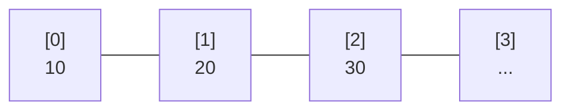

</div>

<div style="position: relative;">

### 2. 佇列（Queue）

<span v-click="1" style="color: #666; font-style: italic;">先進先出 (FIFO)，事件處理</span>

<div v-click="1" style="position: absolute; top: -10px; right: -10px; background: #4ade80; color: white; padding: 4px 8px; border-radius: 12px; font-size: 0.75em; font-weight: bold;">
  ✅ 正確答案
</div>

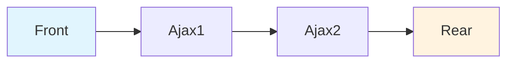

</div>

<div style="max-height: 280px; overflow-y: auto; padding-right: 8px;">

### 3. 堆疊（Stack）

<span v-click="1" style="color: #666; font-style: italic;">後進先出 (LIFO)，函數呼叫</span>

<div style="max-height: 180px; overflow-y: auto;">

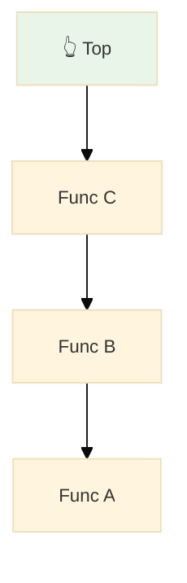

</div>

</div>

<div>

### 4. 雜湊表（Hash Table）

<span v-click="1" style="color: #666; font-style: italic;">快速查找，Key-Value 映射</span>

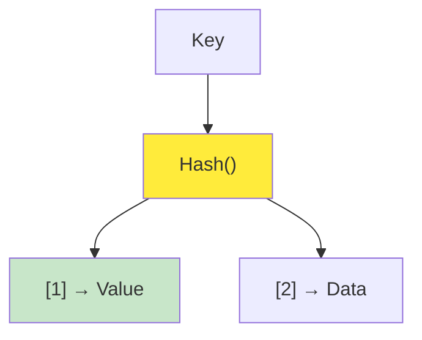

</div>

</div>

---

<div style="margin-top: 30px; padding: 20px; background: linear-gradient(135deg, #f0f9ff 0%, #e0f2fe 100%); border-left: 4px solid #0ea5e9; border-radius: 8px;">
  <strong style="color: #0369a1;">💡 解析：</strong>
  <span style="color: #0c4a6e;">對於購物車的 Ajax 請求處理，佇列的 FIFO 特性確保了請求按照點擊順序處理，避免了競態條件（Race Condition）</span>
</div>


## BUT

由於 Javascript 並沒有內建佇列，我們需要自己實作。

---

# 16.4 在 Javascript 中實作佇列

- 讓點擊處理器能夠將商品加入佇列（Queue）
- 從佇列前端取出處理的項目
- 避免第二條時間線與第一條時間線同時發生
- 修改 calc_cart_total 讓下一項佇列可以開始
- 當陣列為空時，便停止走訪
- 將全域變數包裝進 function 中
  - 由於前面我們使用了 `worker` 等全域變數，我們需要裝進 `Queue()` 中

---
layout: two-cols
---

## 🚨 問題：原始代碼的 Race Condition

<div style="background: #fef2f2; padding: 15px; border-radius: 8px; margin-bottom: 15px; color: #000; border-left: 4px solid #ef4444;">
  <strong>⚠️ 問題描述</strong>：用戶快速點擊時，多個 Ajax 請求同時執行，可能導致資料不一致
</div>

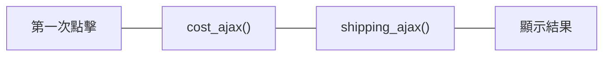

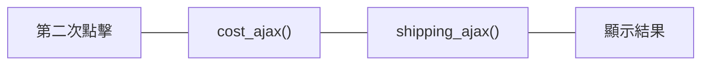

📦 `cost_ajax(cart, function (cost) {...})`

- 意思是「用 cart 當作參數，非同步請求購物車商品的成本」

🚚 `shipping_ajax(cart, function (shipping) {...})`

- 類似地，這個函式代表「請求這個購物車的運費資訊」

::right::

<script setup>
  import Cart from '/components/Cart.vue'
</script>

<div style="margin: 20px 0;">
  <Cart />
</div>

---

## 步驟 1：讓點擊處理器能夠將商品加入佇列

<div v-click="1" style="background: #f0f9ff; padding: 15px; border-radius: 8px; margin-bottom: 15px; color: #000;">
  <strong>目標</strong>：透過 Array 實作佇列，讓購物車事件能夠排隊等待
</div>

<div v-click="2" class="grid grid-cols-2 gap-4">

<div>

## 修改前

```js
function add_item_to_cart(item) {
  cart = add_item(cart, item);
  calc_cart_total(cart, update_total_dom);
}

function calc_cart_total(cart, callback) {
  var total = 0;
  cost_ajax(cart, function (cost) {
    // 🚨 請求購物車商品的成本
    total += cost;
    shipping_ajax(cart, function (shipping) {
      // 🚨 請求購物車運費
      total += shipping;
      callback(total);
    });
  });
}
```

</div>

<div class="overflow-y-scroll h-[350px]">

## 修改後

```js {3,18-24}
function add_item_to_cart(item) {
  cart = add_item(cart, item);
  update_total_queue(cart);
}

function calc_cart_total(cart, callback) {
  var total = 0;
  cost_ajax(cart, function (cost) {
    // 🚨 請求購物車商品的成本
    total += cost;
    shipping_ajax(cart, function (shipping) {
      // 🚨 請求購物車運費
      total += shipping;
      callback(total);
    });
  });
}

var queue_items = []; // 🚨 利用陣列實作佇列

function update_total_queue(cart) {
  // 🚨 將購物車加入佇列
  queue_items.push(cart);
}
```

</div>

</div>

---

## 步驟 1：比較圖

<div class="grid grid-cols-2 gap-4">

<div>

### 修改前

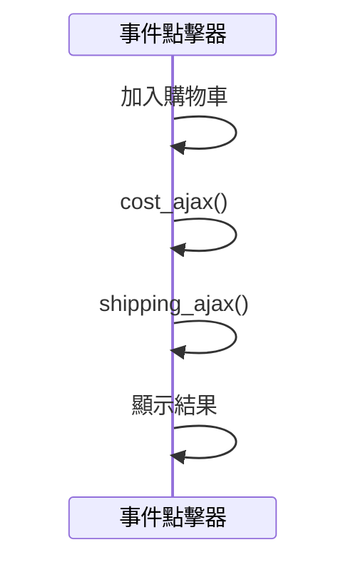

</div>

<div>

### 修改後

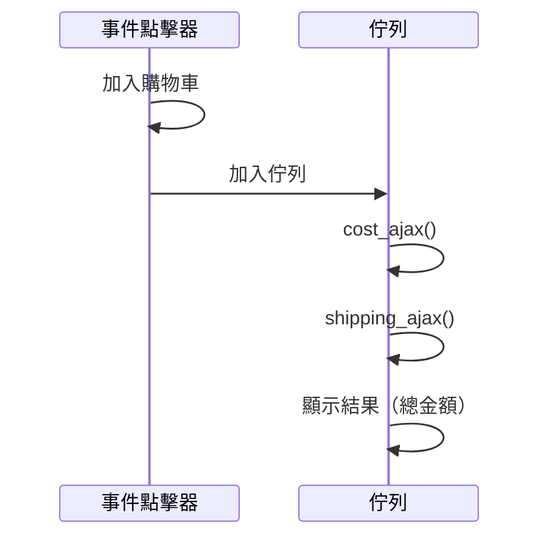

</div>

</div>

---

## 步驟 2：從佇列前端取出待處理的項目

<div v-click="1" style="background: #ecfdf5; padding: 15px; border-radius: 8px; margin-bottom: 15px; color: #000;">
  <strong>關鍵</strong>：修改回調函數以處理下一個佇列項目
</div>

<div v-click="2" class="grid grid-cols-2 gap-4">

<div class="overflow-y-scroll h-[350px]">

## 修改前

```js{3,18-24}
function add_item_to_cart(item) {
  cart = add_item(cart, item);
  update_total_queue(cart);
}

function calc_cart_total(cart, callback) {
  var total = 0;
  cost_ajax(cart, function (cost) {
    // 🚨 請求購物車商品的成本
    total += cost;
    shipping_ajax(cart, function (shipping) {
      // 🚨 請求購物車運費
      total += shipping;
      callback(total);
    });
  });
}

var queue_items = []; // 🚨 利用陣列實作佇列

function update_total_queue(cart) {
  // 🚨 將購物車加入佇列
  queue_items.push(cart);
}
```

</div>

<div class="overflow-y-scroll h-[350px]">

## 修改後

```js{20-24,29}
function add_item_to_cart(item) {
  cart = add_item(cart, item);
  update_total_queue(cart);
}

function calc_cart_total(cart, callback) {
  var total = 0;
  cost_ajax(cart, function (cost) {
    // 🚨 請求購物車商品的成本
    total += cost;
    shipping_ajax(cart, function (shipping) {
      // 🚨 請求購物車運費
      total += shipping;
      callback(total);
    });
  });
}

var queue_items = []; // 🚨 利用陣列實作佇列

function runNext() {
  var cart = queue_items.shift();
  calc_cart_total(cart, update_total_dom);
}

function update_total_queue(cart) {
  // 🚨 將購物車加入佇列
  queue_items.push(cart);
  setTimeout(runNext, 0);
}
```

</div>

</div>

---

## 步驟 2：比較圖

<div class="grid grid-cols-2 gap-4">

<div>

### 修改前


</div>

<div>

### 修改後

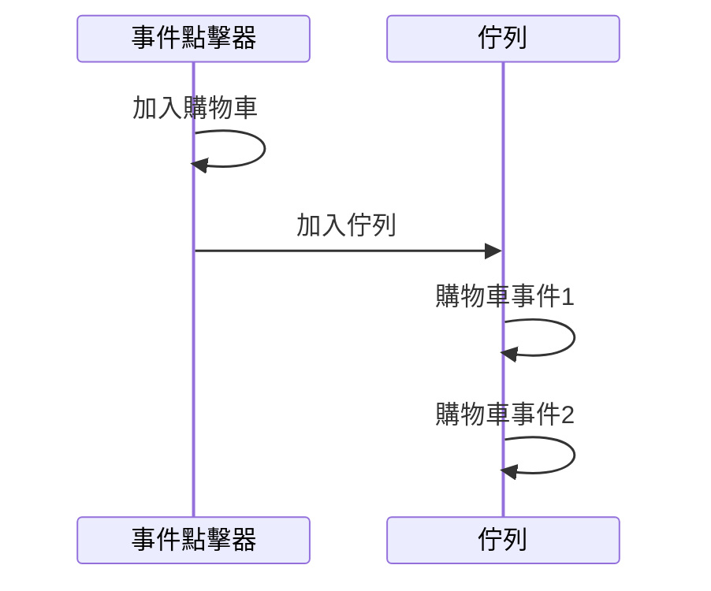

</div>

</div>

---

## 步驟 3：避免第二條時間線和第一條時間線同時發生

<div v-click="1" style="background: #fefce8; padding: 15px; border-radius: 8px; margin-bottom: 15px; color: #000;">
  <strong>目標</strong>：實作佇列的運作機制。
</div>

<div v-click="2" class="grid grid-cols-2 gap-4">

<div class="overflow-y-scroll h-[350px]">

## 修改前

```js
function add_item_to_cart(item) {
  cart = add_item(cart, item);
  update_total_queue(cart);
}

function calc_cart_total(cart, callback) {
  var total = 0;
  cost_ajax(cart, function (cost) {
    // 🚨 請求購物車商品的成本
    total += cost;
    shipping_ajax(cart, function (shipping) {
      // 🚨 請求購物車運費
      total += shipping;
      callback(total);
    });
  });
}

var queue_items = []; // 🚨 利用陣列實作佇列

function runNext() {
  var cart = queue_items.shift();
  calc_cart_total(cart, update_total_dom);
}

function update_total_queue(cart) {
  // 🚨 將購物車加入佇列
  queue_items.push(cart);
  setTimeout(runNext, 0);
}
```

</div>

<div class="overflow-y-scroll h-[350px]">

## 修改後

```js{20-24,29}
function add_item_to_cart(item) {
  cart = add_item(cart, item);
  update_total_queue(cart);
}

function calc_cart_total(cart, callback) {
  var total = 0;
  cost_ajax(cart, function (cost) {
    // 🚨 請求購物車商品的成本
    total += cost;
    shipping_ajax(cart, function (shipping) {
      // 🚨 請求購物車運費
      total += shipping;
      callback(total);
    });
  });
}

var queue_items = [];
var working = false; // 🚨 標記是否正在計算

function runNext() {
  if (working) return; // 🚨 如果正在計算，直接返回
  working = true; // 🚨 設定工作狀態為 true

  // 🚨 從佇列取出第一個項目
  var cart = queue_items.shift();
  calc_cart_total(cart, update_total_dom);
}

function update_total_queue(cart) {
  // 🚨 將購物車加入佇列
  queue_items.push(cart);
  setTimeout(runNext, 0);
}
```

</div>

</div>

---

## 步驟 4：修改 calc_cart_total 讓下一項佇列可以開始

<div v-click="1" style="background: #fefce8; padding: 15px; border-radius: 8px; margin-bottom: 15px; color: #000;">
  <strong>目標</strong>：利用遞迴(Recursion) 讓下一項佇列可以開始。
</div>

<div v-click="2" class="grid grid-cols-2 gap-4">

<div class="overflow-y-scroll h-[350px]">

## 修改前

```js
function add_item_to_cart(item) {
  cart = add_item(cart, item);
  update_total_queue(cart);
}

function calc_cart_total(cart, callback) {
  var total = 0;
  cost_ajax(cart, function (cost) {
    // 🚨 請求購物車商品的成本
    total += cost;
    shipping_ajax(cart, function (shipping) {
      // 🚨 請求購物車運費
      total += shipping;
      callback(total);
    });
  });
}

var queue_items = [];
var working = false; // 🚨 標記是否正在計算

function runNext() {
  if (working) return; // 🚨 如果正在計算，直接返回
  working = true; // 🚨 設定工作狀態為 true

  // 🚨 從佇列取出第一個項目
  var cart = queue_items.shift();
  calc_cart_total(cart, update_total_dom);
}

function update_total_queue(cart) {
  // 🚨 將購物車加入佇列
  queue_items.push(cart);
  setTimeout(runNext, 0);
}
```

</div>

<div class="overflow-y-scroll h-[350px]">

## 修改後

```js{28-31}
function add_item_to_cart(item) {
  cart = add_item(cart, item);
  update_total_queue(cart);
}

function calc_cart_total(cart, callback) {
  var total = 0;
  cost_ajax(cart, function (cost) {
    // 🚨 請求購物車商品的成本
    total += cost;
    shipping_ajax(cart, function (shipping) {
      // 🚨 請求購物車運費
      total += shipping;
      callback(total);
    });
  });
}

var queue_items = [];
var working = false; // 🚨 標記是否正在計算

function runNext() {
  if (working) return; // 🚨 如果正在計算，直接返回
  working = true; // 🚨 設定工作狀態為 true

  // 🚨 從佇列取出第一個項目
  var cart = queue_items.shift();
  calc_cart_total(cart, function (total) { // 🚨 作業已經結束，開始計算下一個
    working = false;
    runNext();
  });
}

function update_total_queue(cart) {
  // 🚨 將購物車加入佇列
  queue_items.push(cart);
  setTimeout(runNext, 0);
}
```

</div>

</div>

---

## 步驟 5：當陣列已空，便停止走訪

<div v-click="1" style="background: #fefce8; padding: 15px; border-radius: 8px; margin-bottom: 15px; color: #000;">
  <strong>目標</strong>：如果佇列（Queue）已空，代表待辦事項已經全部完成，不應該觸發 runNext()。
</div>

<div v-click="2" class="grid grid-cols-2 gap-4">

<div class="overflow-y-scroll h-[350px]">

## 修改前

```js
function add_item_to_cart(item) {
  cart = add_item(cart, item);
  update_total_queue(cart);
}

function calc_cart_total(cart, callback) {
  var total = 0;
  cost_ajax(cart, function (cost) {
    // 🚨 請求購物車商品的成本
    total += cost;
    shipping_ajax(cart, function (shipping) {
      // 🚨 請求購物車運費
      total += shipping;
      callback(total);
    });
  });
}

var queue_items = [];
var working = false; // 🚨 標記是否正在計算

function runNext() {
  if (working) return; // 🚨 如果正在計算，直接返回
  working = true; // 🚨 設定工作狀態為 true

  // 🚨 從佇列取出第一個項目
  var cart = queue_items.shift();
  calc_cart_total(cart, function (total) {
    // 🚨 作業已經結束，開始計算下一個
    working = false;
    runNext();
  });
}

function update_total_queue(cart) {
  // 🚨 將購物車加入佇列
  queue_items.push(cart);
  setTimeout(runNext, 0);
}
```

</div>

<div class="overflow-y-scroll h-[350px]">

## 修改後

```js{24}
function add_item_to_cart(item) {
  cart = add_item(cart, item);
  update_total_queue(cart);
}

function calc_cart_total(cart, callback) {
  var total = 0;
  cost_ajax(cart, function (cost) {
    // 🚨 請求購物車商品的成本
    total += cost;
    shipping_ajax(cart, function (shipping) {
      // 🚨 請求購物車運費
      total += shipping;
      callback(total);
    });
  });
}

var queue_items = [];
var working = false; // 🚨 標記是否正在計算

function runNext() {
  if (working) return; // 🚨 如果正在計算，直接返回
  if (queue_items.length === 0) return; // 🚨 如果佇列是空的，直接返回
  working = true; // 🚨 設定工作狀態為 true

  // 🚨 從佇列取出第一個項目
  var cart = queue_items.shift();
  calc_cart_total(cart, function (total) { // 🚨 作業已經結束，開始計算下一個
    working = false;
    runNext();
  });
}

function update_total_queue(cart) {
  // 🚨 將購物車加入佇列
  queue_items.push(cart);
  setTimeout(runNext, 0);
}
```

</div>

</div>

---

## 步驟 6：封裝佇列的運作機制

<div v-click="1" style="background: #fefce8; padding: 15px; border-radius: 8px; margin-bottom: 15px; color: #000;">
  <strong>目標</strong>：目前佇列涵式散落在 global scope，為了避免被其他方法意外修改，應該要調整成只能讓 Queue() 內部修改。
</div>

<div v-click="2" class="grid grid-cols-2 gap-4">

<div class="overflow-y-scroll h-[350px]">

## 修改前

```js
function add_item_to_cart(item) {
  cart = add_item(cart, item);
  update_total_queue(cart);
}

function calc_cart_total(cart, callback) {
  var total = 0;
  cost_ajax(cart, function (cost) {
    // 🚨 請求購物車商品的成本
    total += cost;
    shipping_ajax(cart, function (shipping) {
      // 🚨 請求購物車運費
      total += shipping;
      callback(total);
    });
  });
}

var queue_items = [];
var working = false; // 🚨 標記是否正在計算

function runNext() {
  if (working) return; // 🚨 如果正在計算，直接返回
  if (queue_items.length === 0) return; // 🚨 如果佇列是空的，直接返回
  working = true; // 🚨 設定工作狀態為 true

  // 🚨 從佇列取出第一個項目
  var cart = queue_items.shift();
  calc_cart_total(cart, function (total) {
    // 🚨 作業已經結束，開始計算下一個
    working = false;
    runNext();
  });
}

function update_total_queue(cart) {
  // 🚨 將購物車加入佇列
  queue_items.push(cart);
  setTimeout(runNext, 0);
}
```

</div>

<div class="overflow-y-scroll h-[350px]">

## 修改後

```js{19-45}
function add_item_to_cart(item) {
  cart = add_item(cart, item);
  update_total_queue(cart);
}

function calc_cart_total(cart, callback) {
  var total = 0;
  cost_ajax(cart, function (cost) {
    // 🚨 請求購物車商品的成本
    total += cost;
    shipping_ajax(cart, function (shipping) {
      // 🚨 請求購物車運費
      total += shipping;
      callback(total);
    });
  });
}

function Queue() {

var queue_items = [];
var working = false; // 🚨 標記是否正在計算

function runNext() {
  if (working) return; // 🚨 如果正在計算，直接返回
  if (queue_items.length === 0) return; // 🚨 如果佇列是空的，直接返回
  working = true; // 🚨 設定工作狀態為 true

  // 🚨 從佇列取出第一個項目
  var cart = queue_items.shift();
  calc_cart_total(cart, function (total) { // 🚨 作業已經結束，開始計算下一個
    working = false;
    runNext();
  });
}

return function (cart) {
  // 🚨 將購物車加入佇列
  queue_items.push(cart);
  setTimeout(runNext, 0);
  };
};

var update_total_queue = Queue(); // 🚨 實際呼叫 Queue() 的地方。
```

</div>

</div>

---

## 休息一下：佇列的策略

> Q: 想一下生活中有哪些資源是共享的例子？

- 廁所的鎖：講門鎖上鎖之後，其他人就不能進入
- 公共圖書館：一次可以提供一群人借書
- 白板：允許一位老師寫白板，同時向整班學生分享資料

### 社會科學：社會資源的分配問題

> 循環經濟（Circular Economy）是一種經濟模式，旨在減少浪費和提高資源利用率，通過循環利用資源，減少對原始材料的依賴，並減少環境影響。

- 腳踏車：買了之後，其他人就不能使用。
  - 所有權：私有。
  - 廠商：追求量多、便宜。

- Youbike：由政府提供，但租借就可以使用。
  - 所有權：政府。
  - 廠商：追求更好的品質、更長的使用壽命。

---

## 16.6 讓佇列可以重複使用 -- 步驟一

<div  style="background: #fefce8; padding: 15px; border-radius: 8px; margin-bottom: 15px; color: #000;">
  <strong>目標</strong>：我們要試著把 Queue() 的內部業務邏輯拆出來，讓 Queue() 可以重複使用。
</div>

<div class="grid grid-cols-2 gap-4 max-h-[300px] overflow-y-scroll">

<div>

## 修改前

```js
function Queue() {
  var queue_items = [];
  var working = false;
  function runNext() {
    if (working) return;
    if (queue_items.length === 0) return;
    working = true;
    var cart = queue_items.shift();
    calc_cart_total(cart, function (total) {
      update_total_dom(total);
      working = false; // 主要控走訪的區塊
      runNext();
    });
  }
  return function (cart) {
    queue_items.push(cart);
    setTimeout(runNext, 0);
  };
}
var update_total_queue = Queue();
```

</div>

<div>

## 修改後

```js{11-20}
function Queue() {
  var queue_items = [];
  var working = false;
  function runNext() {
    if (working) return;
    if (queue_items.length === 0) return;
    working = true;
    var cart = queue_items.shift();
    calc_cart_total(cart, function (total) {
      update_total_dom(total);

      function worker(cart, done) {
        calc_cart_total(cart, function (total) {
          update_total_dom(total);
          done();
        });
      }

      worker(cart, function () {
        working = false;
        runNext();
      });
    });
  }
  return function (cart) {
    queue_items.push(cart);
    setTimeout(runNext, 0);
  };
}
var update_total_queue = Queue();
```

</div>

</div>

---

## 步驟二：Worker 的封裝

<div style="background: #fefce8; padding: 15px; border-radius: 8px; margin-bottom: 15px; color: #000;">
  <strong>目標</strong>：我們可以把 worker() 拆到 Global scope 來，讓 Queue() 直接使用 worker() 來處理業務邏輯。
</div>

<div class="grid grid-cols-2 gap-4 max-h-[300px] overflow-y-scroll">

<div>

## 修改前

```js{11-17}
function Queue() {
  var queue_items = [];
  var working = false;
  function runNext() {
    if (working) return;
    if (queue_items.length === 0) return;
    working = true;
    var cart = queue_items.shift();
    calc_cart_total(cart, function (total) {
      update_total_dom(total);

      function worker(cart, done) {
        calc_cart_total(cart, function (total) {
          update_total_dom(total);
          done();
        });
      }

      worker(cart, function () {
        working = false;
        runNext();
      });
    });
  }
  return function (cart) {
    queue_items.push(cart);
    setTimeout(runNext, 0);
  };
}
var update_total_queue = Queue();
```

</div>

<div>

## 修改後

```js{1,22-35}
function Queue(worker) {
  var queue_items = [];
  var working = false;
  function runNext() {
    if (working) return;
    if (queue_items.length === 0) return;
    working = true;
    var cart = queue_items.shift();
    calc_cart_total(cart, function (total) {
      update_total_dom(total);

      worker(cart, function () {
        working = false;
        runNext();
      });
    });
  }
  return function (cart) {
    queue_items.push(cart);
    setTimeout(runNext, 0);
  };
}

function calc_cart_worker(cart, done) {
  calc_cart_total(cart, function (total) {
    update_total_dom(total);
    done();
  });
}

var update_total_queue = Queue(calc_cart_worker);
```

</div>

</div>

---

## 步驟三：允許佇列儲存 callback

<div style="background: #fefce8; padding: 15px; border-radius: 8px; margin-bottom: 15px; color: #000;">
  <strong>目標</strong>：透過將參數名稱通用化為 `item`，可以使用到更多業務情境。
</div>

<div class="grid grid-cols-2 gap-4 max-h-[300px] overflow-y-scroll">

<div>

## 修改前

```js{8-22}
function Queue(worker) {
  var queue_items = [];
  var working = false;
  function runNext() {
    if (working) return;
    if (queue_items.length === 0) return;
    working = true;
    var cart = queue_items.shift();
    calc_cart_total(cart, function (total) {
      update_total_dom(total);

      worker(cart, function () {
        working = false;
        runNext();
      });
    });
  }
  return function (cart) {
    queue_items.push(cart);
    setTimeout(runNext, 0);
  };
}

function calc_cart_worker(cart, done) {
  calc_cart_total(cart, function (total) {
    update_total_dom(total);
    done();
  });
}

var update_total_queue = Queue(calc_cart_worker);
```

</div>

<div>

## 修改後

```js{8-20}
function Queue(worker) {
  var queue_items = [];
  var working = false;
  function runNext() {
    if (working) return;
    if (queue_items.length === 0) return;
    working = true;
    var item = queue_items.shift(); // 這邊將 cart -> item

    worker(item.data, function () {
        working = false;
        runNext();
      });
  }
  return function (data) { // 這邊將 cart -> data
    queue_items.push({ data } || function () {});
    setTimeout(runNext, 0);
  };
}

function calc_cart_worker(cart, done) {
  calc_cart_total(cart, function (total) {
    update_total_dom(total);
    done();
  });
}

var update_total_queue = Queue(calc_cart_worker);
```

</div>

</div>

---

## 步驟四：當佇列處理完之後，呼叫 callback

<div style="background: #fefce8; padding: 15px; border-radius: 8px; margin-bottom: 15px; color: #000;">
  <strong>目標</strong>：將 callback 參數傳入，讓購物車可以透過回傳的 total 來更新總金額。
</div>

<div class="grid grid-cols-2 gap-4 max-h-[300px] overflow-y-scroll">

<div>

## 修改前

```js
function Queue(worker) {
  var queue_items = [];
  var working = false;
  function runNext() {
    if (working) return;
    if (queue_items.length === 0) return;
    working = true;
    var item = queue_items.shift();

    worker(item.data, function () {
      working = false;
      runNext();
    });
  }
  return function (data) {
    queue_items.push({ data } || function () {});
    setTimeout(runNext, 0);
  };
}

function calc_cart_worker(cart, done) {
  calc_cart_total(cart, function (total) {
    update_total_dom(total);
    done();
  });
}

var update_total_queue = Queue(calc_cart_worker);
```

</div>

<div>

## 修改後

```js{12}
function Queue(worker) {
  var queue_items = [];
  var working = false;
  function runNext() {
    if (working) return;
    if (queue_items.length === 0) return;
    working = true;
    var item = queue_items.shift();

    worker(item.data, function (val) {
        working = false;
        setTimeout(item.callback, 0, val);
        runNext();
      });
  }
  return function (data) {
    queue_items.push({ data } || function () {});
    setTimeout(runNext, 0);
  };
}

function calc_cart_worker(cart, done) {
  calc_cart_total(cart, function (total) {
    update_total_dom(total);
    done();
  });
}

var update_total_queue = Queue(calc_cart_worker);
```

</div>

</div>

---

## 小結：Queue 的特色

> 能不能請你說明一下 Queue 的特點？


- Queue 的正式名稱一該叫做 linearize() ，意思是『線性化』。
- 可以賦予雜亂的排序，透過適當的限制，讓可能性只剩下一種。
- Queue 屬於一種 Concurrency Primitive，可以協調多個非同步操作。

---

# 🤔 16.9 解決策略比較：Queue vs Debounce vs Throttle

<div style="max-height: 80%; overflow-y: auto; display: grid; grid-template-columns: 1fr 1fr 1fr; gap: 15px; font-size: 0.85em; margin: 20px 0;">

<div style=" overflow-y: auto; padding: 15px; border: 2px solid #3b82f6; border-radius: 8px;">

### 🏪 **Queue 策略**

_本章節採用_

**特點**：全部執行，排隊等待

- ✅ 每次點擊都是獨立意圖
- ✅ 確保執行順序
- ✅ 適合真實購買需求

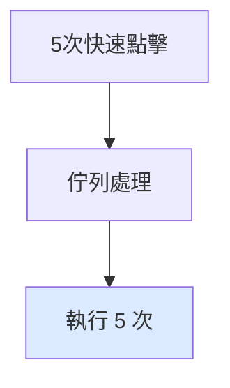

</div>

<div style="padding: 15px; border: 2px solid #f59e0b; border-radius: 8px;">

### ⏱️ **Debounce 策略**

_防抖動_

**特點**：只執行最後一次

- ✅ 防止誤觸重複點擊
- ✅ 節省伺服器資源
- ❌ 可能遺失用戶真實意圖

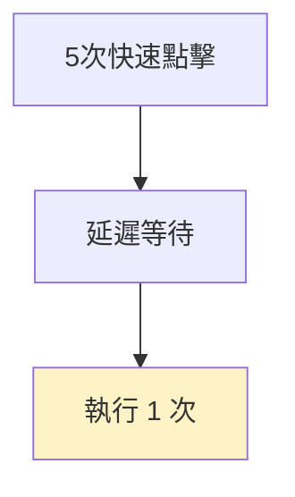

</div>

<div style="padding: 15px; border: 2px solid #10b981; border-radius: 8px;">

### 🚦 **Throttle 策略**

_節流_

**特點**：限制執行頻率

- ✅ 平衡體驗與效能
- ✅ 固定時間間隔執行
- ⚖️ 部分點擊會被忽略

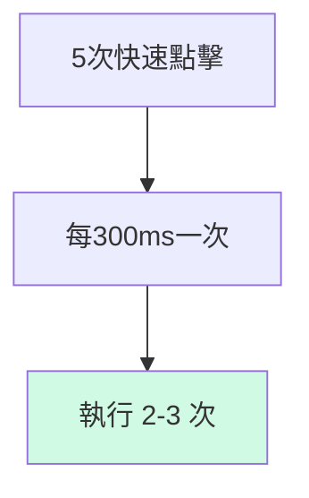

- [Visualizing algorithms for rate limiting](https://smudge.ai/blog/ratelimit-algorithms)

</div>

</div>

---
layout: two-cols
---

# 16.9 Queue 的小尾巴：DroppingQueue

<div style="background: #fefce8; padding: 15px; border-radius: 8px; margin-bottom: 15px; color: #000;">
  <strong>目標</strong>：如果使用者連續點擊多次怎麼辦？每個事件都要處理嗎？
</div>

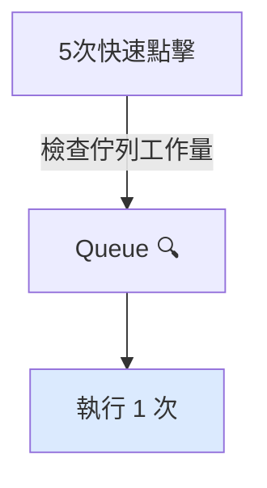

::right::

## 可放棄的資料佇列

<div class="max-h-[400px] overflow-y-scroll">

```js{all|1,22-25,37-55}
function DroppingQueue(max_size, worker) {
  var queue_items = [];
  var working = false;
  function runNext() {
    if (working) return;
    if (queue_items.length === 0) return;
  }

  working = true;

  var item = queue_items.shift();
  worker(item.data, function (val) {
    working = false;
    setTimeout(item.callback, 0, val);
    runNext();
  });


  return function (data) {
    queue_items.push({ data } || function () {});

    while (queue_items.length > max_size) {
      queue_items.shift();
    }

    setTimeout(runNext, 0);
  };
}

function calc_cart_worker(cart, done) {
  calc_cart_total(cart, function (total) {
    update_total_dom(total);
    done();
  });
}

// 最多只會有 1 個資料在佇列中，多的事件會被丟棄
var update_total_queue = DroppingQueue(1, calc_cart_worker);

update_total_queue({
  data: {
    item: "iPhone",
    price: 100,
  },
});

// 不會觸發
update_total_queue({
  data: {
    item: "iPhone Max Pro",
    price: 1000,
  },
});

```

</div>

---

### 💡 實際應用建議

<div style="background: linear-gradient(135deg, #fff7ed 0%, #fed7aa 100%); padding: 20px; border-radius: 8px; border-left: 4px solid #f97316; color: #000;">

**購物車場景**：

- **Queue** 👍 用戶想加入多個相同商品
- **Debounce** 👍 搜尋輸入框、自動儲存
- **Throttle** 👍 滾動事件、拖拽操作

**關鍵考量**：用戶的每次點擊是否都有**獨立的商業價值**？

</div>

---

# 如果遇到前端面試題：請問你如何實作 debounce？

## 🔍 **業務情境：智能搜尋框**

<div style="background: #f8fafc; padding: 20px; border-radius: 8px; border-left: 4px solid #4f46e5; color: #000;">

**問題**：用戶在搜尋框輸入時，每個字母都會觸發 API 請求

- 輸入 "iPhone" → 發送 6 次 API 請求
- 伺服器壓力大，用戶體驗差
- 真正需要的只是最終搜尋結果

</div>

## 回家練習

- [前往 Codepen 練習](https://codepen.io/Chious/pen/dPYMaRj)

---

## 💡 **解決方案：Debounce 實作**

<div style="display: grid; grid-template-columns: 1fr 1fr; gap: 20px; font-size: 0.9em;">

<div>

### **基礎版本**

```javascript
function debounce(func, delay) {
  let timeoutId;

  return function (...args) {
    // 清除之前的計時器
    clearTimeout(timeoutId);

    // 設定新的計時器
    timeoutId = setTimeout(() => {
      func.apply(this, args);
    }, delay);
  };
}
```

</div>

<div>

### **進階版本（支援立即執行）**

```javascript
function debounce(func, delay, immediate = false) {
  let timeoutId;

  return function (...args) {
    const callNow = immediate && !timeoutId;

    clearTimeout(timeoutId);
    timeoutId = setTimeout(() => {
      timeoutId = null;
      if (!immediate) func.apply(this, args);
    }, delay);

    if (callNow) func.apply(this, args);
  };
}
```

</div>

</div>

---

## 🚀 **實際應用**

```javascript
// 搜尋 API 函數
function searchAPI(query) {
  console.log(`搜尋: ${query}`);
  // 實際的 API 請求...
}

// 創建防抖版本
const debouncedSearch = debounce(searchAPI, 300);

// 綁定到搜尋框
document.getElementById("search").addEventListener("input", (e) => {
  debouncedSearch(e.target.value);
});
```

<div style="background: linear-gradient(135deg, #ecfdf5 0%, #d1fae5 100%); padding: 15px; border-radius: 8px; margin-top: 15px; color: #000;">

**✨ 效果**：用戶輸入 "iPhone" 時

- **無防抖**：6 次 API 請求 (i → iP → iPh → iPho → iPhon → iPhone)
- **有防抖**：1 次 API 請求 (iPhone)

</div>

---

# Ch16 小結

<div style="background: #fefce8; padding: 15px; border-radius: 8px; margin-bottom: 15px; color: #000;">
  <strong>重點</strong>：透過 Queue 的資料結構，限縮了多元宇宙（？）發生的可能，賦予了 Actions『時間』的特性。
</div>

- 與 Action 執行順序有關的問題很難重現，且往往能躲過測試。使用時間線圖分析，將他們揪出來。
- Concurrency Primitives 通常是能處理 Actions 的高階函式，能夠賦予 Actions 超能力！
- 複習如何透過 FP 重構程式碼 -- 通用化、拆 callback 等。

❓ 為什麼不使用 Promise 來處理？

Ans: 因為這本書主要專注在 FP，Concurreny Primitives 並不限制於 Javascript 實作。

## 章節問題

1. 日常開發中有哪些需要安排前後順序（避免 Race Condition）的例子嗎？
2. 在 React 實際開發中不會真的去畫時間線，同時可以如何安排非同步的程式碼，讓 Vitest 更好測試？
3. 解釋 Concurrency Primitives 是什麼？

---

# AI 蝦問：如何做單元測試？

<div style="background: #fefce8; padding: 15px; border-radius: 8px; margin-bottom: 15px; color: #000;">
  <strong>問題</strong>：「在 React 或實際開發中不會真的去畫時間線圖，那這句話是不是太理論了？要怎麼實際應用？」
</div>

<article class="max-h-[400px] overflow-y-scroll p-4">

> 1. `fetch` 發出來了嗎？（request 發動）
> 2. `fetch` 回來後，資料有被正確處理嗎？（資料處理、UI 更新）
> 3. `fetch` 出錯時，我的錯誤處理機制有觸發嗎？
> 4. 多次 `fetch` 時，處理順序會不會影響最終結果？（race condition）

| 層級              | 關注點       | 測試方式           | 測試重點         |
| ----------------- | ------------ | ------------------ | ---------------- |
| Pure logic        | 無副作用     | 單元測試           | 入出對應         |
| 副作用封裝        | 請求本身     | mock fetch         | 請求成功/失敗    |
| Hook / controller | 狀態變化流程 | 測 loading / error | 狀態流程         |
| UI 元件           | 呈現正確畫面 | `render`, `screen` | 使用者看到的東西 |

## 🎯 範例情境：關鍵字搜尋 (Search)

使用者輸入關鍵字，會：

1. debounce 後發送搜尋 API（`/api/search?q=xxx`）
2. 顯示 loading 或錯誤
3. 成功後渲染搜尋結果清單

## 🔹層級 1：純資料邏輯（Pure Logic）

### 📦 負責邏輯：

把 raw API response 轉換為前端想要的格式

```ts
// utils/parseSearchResult.ts
export function parseSearchResult(data: any): string[] {
  return data.results?.map((item: any) => item.title) ?? [];
}
```

### ✅ 測試範例：

```ts
test("parse search results correctly", () => {
  const input = { results: [{ title: "React" }, { title: "Vue" }] };
  expect(parseSearchResult(input)).toEqual(["React", "Vue"]);
});
```

> 💡 **好測**，因為是純函式、無依賴。

## 🔹層級 2：副作用封裝層（fetch / axios）

### 📦 負責發送 API 請求

```ts
// api/search.ts
export async function fetchSearchResults(query: string): Promise<any> {
  const res = await fetch(`/api/search?q=${encodeURIComponent(query)}`);
  if (!res.ok) throw new Error("Search failed");
  return res.json();
}
```

### ✅ 測試範例（mock fetch）：

```ts
import { fetchSearchResults } from "./search";

test("fetchSearchResults returns data", async () => {
  global.fetch = vi.fn().mockResolvedValue({
    ok: true,
    json: () => Promise.resolve({ results: [{ title: "React" }] }),
  });

  const data = await fetchSearchResults("react");
  expect(data.results[0].title).toBe("React");
});
```

> 💡 不測內部網路，只測「這個 function 有正確處理 fetch」。

## 🔹層級 3：整合層（hook / controller）

### 📦 負責 loading / error 狀態管理、使用 debounce

```ts
// hooks/useSearch.ts
import { useState, useEffect } from "react";
import { fetchSearchResults } from "@/api/search";
import { parseSearchResult } from "@/utils/parseSearchResult";

export function useSearch(keyword: string) {
  const [results, setResults] = useState<string[]>([]);
  const [loading, setLoading] = useState(false);
  const [error, setError] = useState<null | string>(null);

  useEffect(() => {
    if (!keyword) return;

    const controller = new AbortController();
    const timeout = setTimeout(() => {
      setLoading(true);
      fetchSearchResults(keyword)
        .then((data) => setResults(parseSearchResult(data)))
        .catch((err) => setError(err.message))
        .finally(() => setLoading(false));
    }, 500);

    return () => {
      clearTimeout(timeout);
      controller.abort();
    };
  }, [keyword]);

  return { results, loading, error };
}
```

### ✅ 測試方式：狀態變化流程（mock fetch + fake timer）

```ts
import { renderHook } from "@testing-library/react";
import { useSearch } from "./useSearch";
import { vi } from "vitest";

vi.useFakeTimers();

test("search works with debounce and returns results", async () => {
  global.fetch = vi.fn().mockResolvedValue({
    ok: true,
    json: () => Promise.resolve({ results: [{ title: "React" }] }),
  });

  const { result } = renderHook(() => useSearch("react"));

  expect(result.current.loading).toBe(false);
  vi.advanceTimersByTime(500);

  await vi.runAllTimersAsync();

  expect(result.current.loading).toBe(false);
  expect(result.current.results).toEqual(["React"]);
});
```

> 💡 測試 debounce + 狀態變化，是 hook 層的測試精髓。

## 🔹層級 4：UI 元件層

### 📦 負責顯示資料、錯誤、loading

```tsx
// components/SearchBox.tsx
export function SearchBox({ keyword }: { keyword: string }) {
  const { results, loading, error } = useSearch(keyword);

  if (loading) return <p>Loading...</p>;
  if (error) return <p>Error: {error}</p>;

  return (
    <ul>
      {results.map((r) => (
        <li key={r}>{r}</li>
      ))}
    </ul>
  );
}
```

### ✅ 測試方式：畫面內容（搭配 `@testing-library/react`）

```ts
test('shows results when done', async () => {
  global.fetch = vi.fn().mockResolvedValue({
    ok: true,
    json: () => Promise.resolve({ results: [{ title: 'React' }] }),
  })

  render(<SearchBox keyword="react" />)
  expect(screen.getByText(/Loading.../i)).toBeInTheDocument()

  await screen.findByText('React') // 等結果出現
})
```

> 💡 重點：UI 層不要測「資料處理」與「fetch」，只測畫面行為即可。

</article>

---
layout: center
---

# Ch17. 協調時間線

---

## 章節回顧

| 原則                      | 說明                                     | 範例                   |
| ------------------------- | ---------------------------------------- | ---------------------- |
| ✅ 時間線數量越少越好     | 時間線數量越少，程式碼越容易理解         | 重構 Actions           |
| ✅ 時間線上的步驟越少越好 | 時間線上的步驟越少，程式碼越容易理解     | 重構 Actions           |
| ✅ 資源共享越少越好       | 資源共享越少，程式碼越容易理解           | 全域 -> 區域           |
| ✅ 協調有共享資源的時間線 | 協調有共享資源的時間線，程式碼越容易理解 | 套用事件佇列           |
| 👉 更改程式的時間模型     | 更改程式的時間模型，程式碼越容易理解     | Concurrency Primitives |

---

## 17.2 新 BUG!!!

- 剛剛我們解決了 Race Condition 的問題
- BUT: 有時候會觸發計算運費、有時候不會，這是為什麼？

<script setup>
  import Cart_Bug from '/components/Cart_Bug.vue'
</script>

<div style="margin: 20px 0;">
  <Cart_Bug />
</div>

<p style="font-size: 0.8em; color: gray;">Murmur: Code Quality 太差了吧！請在 CI/CD 新增 test_stage，確保成功通過 Unit Test / E2E 才能合併！</p>

---
layout: two-cols
---

## 17.3 New Ticket!

### 🚨 ㄧ、問題敘述

> 問題：購物車的總金額會算錯運費，導致 UI 顯示不正確

### 🔍 二、問題重現

> 1. **一開始購物車是空的**
> 2. **點擊加入購物車**
> 3. **顯示費用 100 元（貨物） + 50 元（運費）= 150 元 （總金額）** -> ✅ **正常**
> 4. **再次加入購物車，卻顯示 200 元** -> 😭 **金額異常**

### ⏱️ 三、時間:

今天 16:00 前

### 💡 四、備註：

1. 修改完請回報 @PM、@ 喬治 Thanks :)
2. 需通過測試案例

::right::


---

### 修改後（Not Working）

> 在修改後，我們能夠同時呼叫 `cost_ajax()` 和 `shipping_ajax()`。

```js{all|7-13}
function add_item_to_cart(item) {
  cart = add_item(cart, item);
  update_total_queue(cart);
}
function calc_cart_total(cart, callback) {
  var total = 0;
  cost_ajax(cart, function (cost) {
    total += cost;
  });
  shipping_ajax(cart, function (shipping) {
    total += shipping;
    callback(total);
  });
}
function calc_cart_worker(cart, done) {
  calc_cart_total(cart, function (total) {
    update_total_dom(total);
    done(total);
  });
}
var update_total_queue = DroppingQueue(1, calc_cart_worker);
```

---

## 先說結論：因為 `cost_ajax()` 和 `shipping_ajax()` 回傳時間不一樣

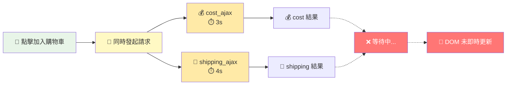

---

# Q: 哪些是 Actions ?

> Actions 的定義：會隨著時間而改變執行的結果。

1. `cost_ajax(cart, callback)` <span v-click="1" style="color: #000;">✅ API 呼叫</span>
2. `add_item(cart, item)` <span v-click="1" style="color: #000;">❌ Calculation 計算</span>
3. `update_total_dom(total)` <span v-click="1" style="color: #000;">✅ DOM 操作</span>
4. `var total = 0` <span v-click="1" style="color: #000;">✅ 區域變數</span>
5. `total += cost` <span v-click="1" style="color: #000;">✅ 修改區域變數</span>
6. `setTimeout(runNext, 0)` <span v-click="1" style="color: #000;">✅ 非同步操作</span>
7. `Math.max(10, 20)` <span v-click="1" style="color: #000;">❌ Calculation 數學運算</span>
8. `console.log("完成")` <span v-click="1" style="color: #000;">✅ 輸出結果</span>

---

## 17.4 ~ 17.6 分析時間軸

- 步驟1：辨識 Actions

```js{all|3-4,6-13,17}
function add_item_to_cart(item) {
  cart = add_item(cart, item);
  update_total_queue(cart); // Action: 事件佇列
}
function calc_cart_total(cart, callback) {
  var total = 0; // Action: 區域變數
  cost_ajax(cart, function (cost) { // Action: API 呼叫
    total += cost;
  });
  shipping_ajax(cart, function (shipping) { // Action: API 呼叫
    total += shipping; // Action: total 區域變數
    callback(total); // Action: total 區域變數
  });
}
function calc_cart_worker(cart, done) {
  calc_cart_total(cart, function (total) {
    update_total_dom(total); // Action: DOM 操作
    done(total);
  });
}

var update_total_queue = DroppingQueue(1, calc_cart_worker);
```

---

## 步驟2：將 Actions 的時間軸畫出來

```js{all}
function add_item_to_cart(item) {
  cart = add_item(cart, item);     // 1. 讀取 Cart, 2. 寫入 Cart
  update_total_queue(cart);        // 3. 讀取 Cart, 4. 呼叫 update_total_queue()
}
function calc_cart_total(cart, callback) {
  var total = 0;                   // 5. 初始化 total = 0
  cost_ajax(cart, function (cost) { // 6. 呼叫 cost_ajax()
    total += cost;                 // 7. 讀取 total, 8. 寫入 total
  });
  shipping_ajax(cart, function (shipping) { // 9. 呼叫 shipping_ajax()
    total += shipping;             // 10. 讀取 total, 11. 寫入 total
    callback(total);               // 12. 呼叫 total
  });
}
function calc_cart_worker(cart, done) {
  calc_cart_total(cart, function (total) {
    update_total_dom(total);       // 13. 呼叫 update_total_dom()
    done(total);
  });
}

var update_total_queue = DroppingQueue(1, calc_cart_worker);
```

---
layout: two-cols
---

## 程式碼-1

```js{all}
function add_item_to_cart(item) {
  cart = add_item(cart, item);     // 1. 讀取 Cart, 2. 寫入 Cart
  update_total_queue(cart);        // 3. 讀取 Cart, 4. 呼叫 update_total_queue()
}
function calc_cart_total(cart, callback) {
  var total = 0;                   // 5. 初始化 total = 0
  cost_ajax(cart, function (cost) { // 6. 呼叫 cost_ajax()
    total += cost;                 // 7. 讀取 total, 8. 寫入 total
  });
  shipping_ajax(cart, function (shipping) { // 9. 呼叫 shipping_ajax()
    total += shipping;             // 10. 讀取 total, 11. 寫入 total
    callback(total);               // 12. 呼叫 total
  });
}
function calc_cart_worker(cart, done) {
  calc_cart_total(cart, function (total) {
    update_total_dom(total);       // 13. 呼叫 update_total_dom()
    done(total);
  });
}

var update_total_queue = DroppingQueue(1, calc_cart_worker);
```

::right::

## 時間軸

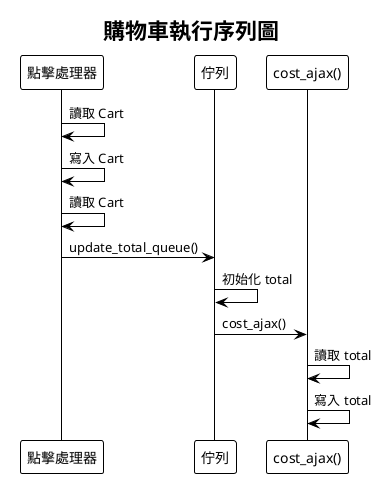

---
layout: two-cols
---

## 程式碼-2

```js{all,10-22}
function add_item_to_cart(item) {
  cart = add_item(cart, item);     // 1. 讀取 Cart, 2. 寫入 Cart
  update_total_queue(cart);        // 3. 讀取 Cart, 4. 呼叫 update_total_queue()
}
function calc_cart_total(cart, callback) {
  var total = 0;                   // 5. 初始化 total = 0
  cost_ajax(cart, function (cost) { // 6. 呼叫 cost_ajax()
    total += cost;                 // 7. 讀取 total, 8. 寫入 total
  });
  shipping_ajax(cart, function (shipping) { // 9. 呼叫 shipping_ajax()
    total += shipping;             // 10. 讀取 total, 11. 寫入 total
    callback(total);               // 12. 呼叫 total
  });
}
function calc_cart_worker(cart, done) {
  calc_cart_total(cart, function (total) {
    update_total_dom(total);       // 13. 呼叫 update_total_dom()
    done(total);
  });
}

var update_total_queue = DroppingQueue(1, calc_cart_worker);
```

::right::

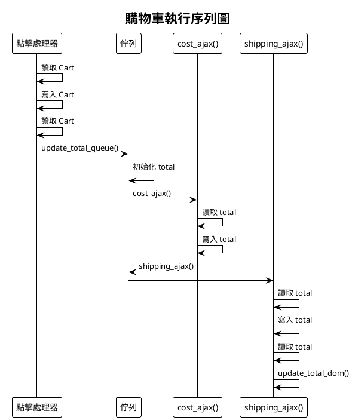

---
layout: two-cols
---

## 簡化步驟1


::right::

## 💡 Tips

- 如果是連續的 Action，可以簡化成一個時間軸

---
layout: two-cols
---

## 簡化步驟1


::right::

## 簡化步驟2


> 💡 由於這幾條時間線都共用 `total` 變數，所以可以簡化

---
layout: two-cols
---

## 17.9 時間線圖分析


::right::

- 由於所有時間軸都共用 `total` 變數，因此會產生時間上的 Race Condition

---

## 17.10 實現 Concurrency Primitives

> Concurrency Primitives 是一組工具或機制，用於幫助開發者在並行程式中管理共享資源的存取，並協調不同執行緒或行程之間的行為。它們提供了一種方式來控制執行順序，避免競爭條件，並確保資料的一致性。

- 你和朋友正在忙著不同的工作，但是你想一起吃午餐，如果約定『先完成的人等待後完成的人』，就可以保證無論誰先完成，最後都能一起吃午餐。

<section class="grid grid-cols-2 gap-4">

<div>

### 使用 `Cut()`

```js
function Cut(number, callback) {
  var num_finished = 0;
  return function () {
    num_finished++;
    if (num_finished === number) {
      callback();
    }
  };
}
```

</div>

<div>

### 範例

```js
var done = Cut(3, function () {
  console.log("好誒！今天吃烤雞！");
});
```

```js
done();
done();
done();
```

</div>

</section>

---

## 17.11 在『放入購物車』程式裡應用 Cut()

<section class="grid grid-cols-2 gap-4">

<div>

### 修改前

```js
function calc_cart_total(cart, callback) {
  var total = 0;
  cost_ajax(cart, function (cost) {
    total += cost;
  });
  shipping_ajax(cart, function (shipping) {
    total += shipping;
    callback(total);
  });
}
```

</div>

<div class="max-h-[300px] overflow-y-auto">

### 修改後

```js
function Cut(number, callback) {
  var num_finished = 0;
  return function () {
    num_finished++;
    if (num_finished === number) {
      callback();
    }
  };
}

function calc_cart_total(cart, callback) {
  var total = 0;
  var done = Cut(2, function () {
    callback(total);
  });

  cost_ajax(cart, function (cost) {
    total += cost;
    done();
  });
  shipping_ajax(cart, function (shipping) {
    total += shipping;
    done();
  });
}
```

</div>

</section>

---

## 17.15 讓 Action 只能執行一次 primitive

> 如果今天我想要讓某個 function 只能執行一次，該怎麼辦？

```js
function JustOnce(callback) {
  var is_done = false;
  if (is_done) return;

  return function () {
    is_done = true;
    callback();
  };
}

var done = JustOnce(function () {
  console.log("好誒！今天吃烤雞！");
});

done(); // 好誒！今天吃烤雞！
done(); // 不會再執行
done(); // 不會再執行
```

---

## 17.16 隱性 vs 顯性時間模型

### 🔍 兩種時間模型對比

<div style="display: grid; grid-template-columns: 1fr 1fr; gap: 20px; font-size: 0.9em;">

<div style="background: #fef2f2; padding: 15px; border-radius: 8px; border-left: 4px solid #ef4444;">

### ❌ **隱性時間模型**

_依賴程式語言的執行順序_

- 程式碼順序 = 執行順序
- 難以預測非同步結果
- 競態條件難以控制
- 依賴運氣和時機

```javascript
// 隱性：依賴 JavaScript 執行順序
cost_ajax(cart, callback1);
shipping_ajax(cart, callback2);
// 😰 不知道誰先完成
```

</div>

<div style="background: #f0f9ff; padding: 15px; border-radius: 8px; border-left: 4px solid #3b82f6;">

### ✅ **顯性時間模型**

_業務邏輯控制執行順序_

- 明確定義執行條件
- 可預測的執行結果
- 主動協調時間線
- 業務邏輯驅動

```javascript
// 顯性：用 Cut() 明確協調
var done = Cut(2, updateDOM);
cost_ajax(cart, done);
shipping_ajax(cart, done);
// 😎 確保兩個都完成才更新
```

</div>

</div>

---

### 💡 實際應用：從隱性到顯性

<div style="background: #f8f9fa; padding: 20px; border-radius: 8px; margin: 20px 0;">

#### 🔄 重構步驟

1. **識別時間依賴**：找出有順序要求的操作
2. **選擇 Primitives**：`Cut()`, `Queue()`, `JustOnce()` 等
3. **明確協調邏輯**：用程式碼表達業務規則
4. **測試邊界情況**：確保各種時序都正確

#### 🎯 關鍵原則

> **"讓程式碼表達業務意圖，而不是依賴執行環境的偶然性"**

</div>

---

### 📚 常用的 Concurrency Primitives

| Primitive          | 用途              | 範例場景          |
| ------------------ | ----------------- | ----------------- |
| `Cut(n, callback)` | 等待 n 個操作完成 | 等待多個 API 回應 |
| `Queue()`          | 序列化操作        | 購物車計算排隊    |
| `JustOnce()`       | 確保只執行一次    | 防止重複提交      |
| `Timeout()`        | 設定執行期限      | API 超時處理      |

---

# 17.17 小結：操作時間線的技巧

| 原則                      | 說明                                     | 範例         |
| ------------------------- | ---------------------------------------- | ------------ |
| ✅ 時間線數量越少越好     | 時間線數量越少，程式碼越容易理解         | 重構 Actions |
| ✅ 時間線上的步驟越少越好 | 時間線上的步驟越少，程式碼越容易理解     | 重構 Actions |
| ✅ 資源共享越少越好       | 資源共享越少，程式碼越容易理解           | 全域 -> 區域 |
| ✅ 協調有共享資源的時間線 | 協調有共享資源的時間線，程式碼越容易理解 | 套用事件佇列 |
| ✅ 更改程式的時間模型     | 更改程式的時間模型，程式碼越容易理解     |              |

---

# 下週預告

- Ch18. 反應式設計與洋蔥架構

---

## 上禮拜的小尾巴：[Android 開發者入門手冊](https://developer.android.com/kotlin/coroutines?hl=zh-tw)

> 分層設計回過頭來，都是在處理時間線的問題。


---

## Android 上的登入請求

```kotlin
sealed class Result<out R> {
    data class Success<out T>(val data: T) : Result<T>()
    data class Error(val exception: Exception) : Result<Nothing>()
}

class LoginRepository(private val responseParser: LoginResponseParser) {
    private const val loginUrl = "https://example.com/login"

    // Function that makes the network request, blocking the current thread
    fun makeLoginRequest(
        jsonBody: String
    ): Result<LoginResponse> {
        val url = URL(loginUrl)
        (url.openConnection() as? HttpURLConnection)?.run {
            requestMethod = "POST"
            setRequestProperty("Content-Type", "application/json; utf-8")
            setRequestProperty("Accept", "application/json")
            doOutput = true
            outputStream.write(jsonBody.toByteArray())
            return Result.Success(responseParser.parse(inputStream))
        }
        return Result.Error(Exception("Cannot open HttpURLConnection"))
    }
}
```

---

## 透過 Coroutines 來協調不同 I/O 操作

> Java 同 Javascript 一樣，都是單執行緒的程式語言，因此會被堵住，因此其他 UI 會無法互動。

```kotlin

// 事件綁定(View Model)
val button: Button = findViewById(R.id.corky)

button.setOnClickListener { view ->
    login_repository.makeLoginRequest(jsonBody)
}

// 登入請求
class LoginRepository(...) {
    ...
    suspend fun makeLoginRequest(
        jsonBody: String
    ): Result<LoginResponse> {

        // Move the execution of the coroutine to the I/O dispatcher
        return withContext(Dispatchers.IO) {
            // Blocking network request code
        }
    }
}
```

---

# 參考資料

- 電子書：https://livebook.manning.com/book/grokking-simplicity/chapter-16#1

- [Visualizing algorithms for rate limiting](https://smudge.ai/blog/ratelimit-algorithms)
