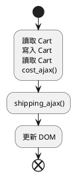

---
# You can also start simply with 'default'
theme: seriph
# random image from a curated Unsplash collection by Anthony
# like them? see https://unsplash.com/collections/94734566/slidev
background: https://cover.sli.dev
# some information about your slides (markdown enabled)
title: Welcome to Slidev
info: |
  ## Slidev Starter Template
  Presentation slides for developers.

  Learn more at [Sli.dev](https://sli.dev)
# apply unocss classes to the current slide
class: text-center
# https://sli.dev/features/drawing
drawings:
  persist: false
# slide transition: https://sli.dev/guide/animations.html#slide-transitions
transition: slide-left
# enable MDC Syntax: https://sli.dev/features/mdc
mdc: true
# open graph
# seoMeta:
#  ogImage: https://cover.sli.dev
---

#《簡約的軟體開發思維：用 Functional Programming 重構程式》CH16 ~ CH17

<div @click="$slidev.nav.next" class="mt-12 py-1" hover:bg="white op-10">
  Press Space for next page <carbon:arrow-right />
</div>

<div class="abs-br m-6 text-xl">
  <button @click="$slidev.nav.openInEditor()" title="Open in Editor" class="slidev-icon-btn">
    <carbon:edit />
  </button>
  <a href="https://github.com/slidevjs/slidev" target="_blank" class="slidev-icon-btn">
    <carbon:logo-github />
  </a>
</div>

<!--
The last comment block of each slide will be treated as slide notes. It will be visible and editable in Presenter Mode along with the slide. [Read more in the docs](https://sli.dev/guide/syntax.html#notes)
-->

---

# 《簡約的軟體開發思維：用 Functional Programming 重構程式》CH16 ~ CH17

## 目錄

- [上週回顧](#上週回顧)
- [Ch16. 多條時間線共享資源](#ch16-多條時間線共享資源)
- [Ch17. 協調時間線](#ch17-協調時間線)

---

## 上週回顧

### 時間線的設計原則

1. 時間線數量越少越好
2. 時間線上的步驟越少越好
3. 資源共享越少越好
4. 協調有共享資源的時間線
5. 更改程式的時間模型

## Ch16. 多條時間線共享資源

> Concurrency primitives：指的是處理併發操作的基本工具

### 章節提問

1. 當有多條時間線時，謝列哪些資源的共享可能會導致問題？

- 全域變數
- 文件物件模型（DOM）
- Calculation 函式
- 區域變數
- 不可變的數值
- 資料庫
- API 呼叫

---

## Ch17. 協調時間線

先前的流程圖



> 這邊要講重構的流程

```js
function add_item_to_cart(item) {
  cart = add_item(cart, item);
  calc_cart_total(cart, update_total_dom);
}
function calc_cart_total(cart, callback) {
  var total = 0;
  cost_ajax(cart, function (cost) {
    total += cost;
    shipping_ajax(cart, function (shipping) {
      total += shipping;
      callback(total);
    });
  });
}
```

### 讓點擊處理器就能將商品加入佇列

```js
function add_item_to_cart(item) {
  cart = add_item(cart, item);
  calc_cart_total(cart, update_total_dom);
}

function calc_cart_total(cart, callback) {
  var total = 0;
  cost_ajax(cart, function (cost) {
    total += cost;
    shipping_ajax(cart, function (shipping) {
      total += shipping;
      callback(total);
    });
  });
}

var queue_items = [];

function update_total_queue(total) {
  queue_items.push(total);
}
```
