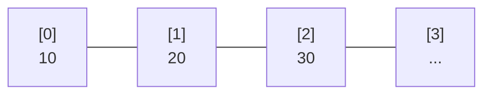
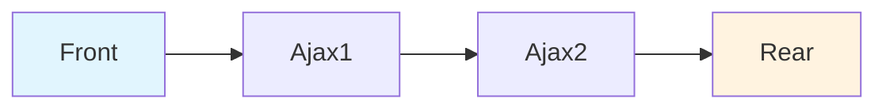
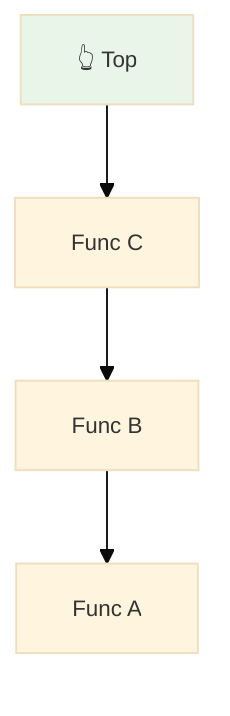
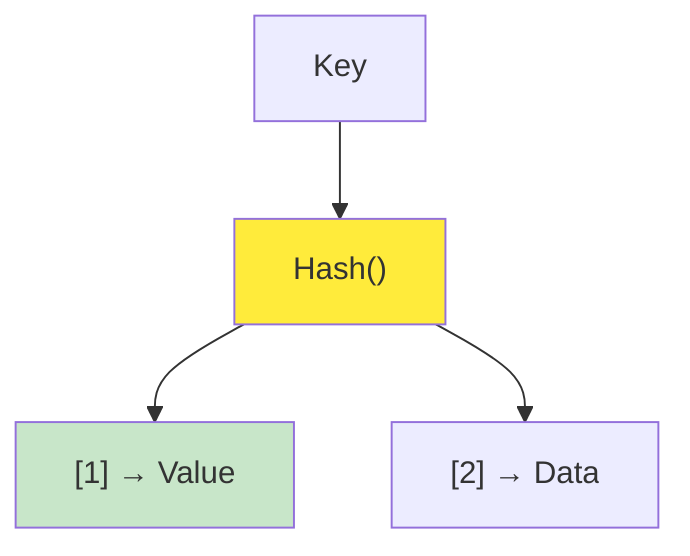
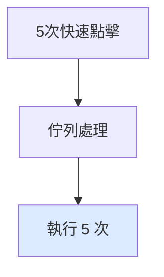
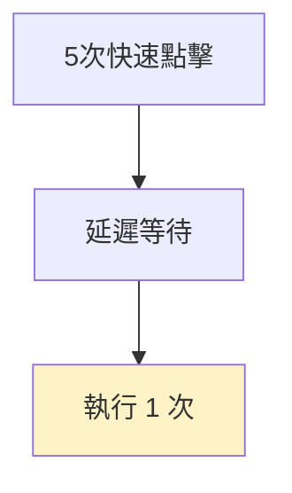
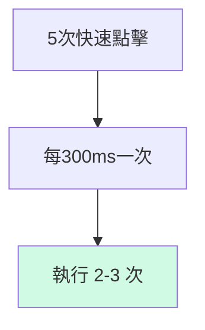
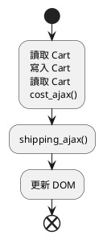

# 《簡約的軟體開發思維：用 Functional Programming 重構程式》CH16 ~ CH17

<div @click="$slidev.nav.next" class="mt-12 py-1" hover:bg="white op-10">
  Press Space for next page <carbon:arrow-right />
</div>

<div class="abs-br m-6 text-xl">
  <button @click="$slidev.nav.openInEditor()" title="Open in Editor" class="slidev-icon-btn">
    <carbon:edit />
  </button>
  <a href="https://github.com/slidevjs/slidev" target="_blank" class="slidev-icon-btn">
    <carbon:logo-github />
  </a>
</div>

---

# 目錄

- [上週回顧](#上週回顧)
- [Ch16. 多條時間線共享資源](#ch16-多條時間線共享資源)
- [Ch17. 協調時間線](#ch17-協調時間線)

---

# 上週回顧：購物車誤植


---
layout: two-cols
---

### 如何畫出時間線

1. 先辨識所有 Actions
2. Actions 有固定先後順序，則將他們畫在同一條時間線上
3. Actions 可同時發生或不需遵循特定順序，則他們屬於不同時間線。

<script setup>
import { ref } from 'vue'
import Dropdown from '/components/Dropdown.vue'

const selectedStation = ref('')
const selectedObject = ref(null)

const handleStationChange = (option) => {
  selectedObject.value = option
}
</script>

<div style="display: flex; align-items: center; gap: 20px; margin: 20px 0;">
  <div>
    <Dropdown 
      v-model="selectedStation" 
      @change="handleStationChange"
    />
  </div>
  
  <div style="padding: 12px; border: 1px solid #e2e8f0; border-radius: 8px; background: #f8f9fa; min-width: 150px;">
    <pre v-if="selectedObject" style="margin: 8px 0 0 0; font-size: 12px; color: #000; overflow-y: scroll; max-height: 49px;">{{ JSON.stringify(selectedObject, null, 2) }}</pre>
    <span v-else style="color: #718096; font-style: italic;">尚未選擇</span>
  </div>
</div>

### 時間線的設計原則

1. 時間線數量越少越好
2. 時間線上的步驟越少越好
3. 資源共享越少越好
4. 協調有共享資源的時間線
5. 更改程式的時間模型

::right::


---
layout: two-cols
---

## 上週回顧

上週我們在處理購物車重複計算的問題。

- `環境變數` ：依賴全域變數 -> 重構成區域變數

- `增加函數的可重用性`：隱性輸入 -> 顯性輸入/輸出

```js{all|1}
function calc_cart_total(cart, callback) {
  var total = 0;
  cost_ajax(cart, function (cost) {
    total += cost;
    shipping_ajax(cart, function (shipping) {
      total += shipping;
      callback(total);
    });
  });
}
```

::right::


---

# 仍然有些原則是我們沒提到的

| 原則                      | 說明                                     | 範例         |
| ------------------------- | ---------------------------------------- | ------------ |
| ✅ 時間線數量越少越好     | 時間線數量越少，程式碼越容易理解         | 重構 Actions |
| ✅ 時間線上的步驟越少越好 | 時間線上的步驟越少，程式碼越容易理解     | 重構 Actions |
| ✅ 資源共享越少越好       | 資源共享越少，程式碼越容易理解           | 全域 -> 區域 |
| 👉 協調有共享資源的時間線 | 協調有共享資源的時間線，程式碼越容易理解 | 套用事件佇列 |
| 更改程式的時間模型        | 更改程式的時間模型，程式碼越容易理解     |              |

---
layout: center
---

# Ch16. 多條時間線共享資源

> Concurrency primitives：指的是處理併發操作的基本工具

---
layout: two-cols
---

### 案例：購物車誤植

> 購物車誤植：購物車的總金額計算錯誤，導致購物車的總金額不正確

<div style="display: flex; justify-content: center;">
  
</div>

::right::

### 哪一件事情會先發生？

- 第一次點擊：
  - 加入購物車
  - 觸發 `計算總金額 ajax`
  - 更新 DOM
- 第二次點擊：
  - 加入購物車
  - 觸發 `計算總金額 ajax`
  - 更新 DOM

---

# Ｑ：請問我該使用哪種資料結構？

<div style="display: grid; grid-template-columns: 1fr 1fr; gap: 20px; font-size: 0.9em;">

<div>

### 1. 陣列（Array）

<span v-click="1" style="color: #666; font-style: italic;">存取連續型的資料</span>



</div>

<div style="position: relative;">

### 2. 佇列（Queue）

<span v-click="1" style="color: #666; font-style: italic;">先進先出 (FIFO)，事件處理</span>

<div v-click="1" style="position: absolute; top: -10px; right: -10px; background: #4ade80; color: white; padding: 4px 8px; border-radius: 12px; font-size: 0.75em; font-weight: bold;">
  ✅ 正確答案
</div>



</div>

<div style="max-height: 280px; overflow-y: auto; padding-right: 8px;">

### 3. 堆疊（Stack）

<span v-click="1" style="color: #666; font-style: italic;">後進先出 (LIFO)，函數呼叫</span>

<div style="max-height: 180px; overflow-y: auto;">



</div>

</div>

<div>

### 4. 雜湊表（Hash Table）

<span v-click="1" style="color: #666; font-style: italic;">快速查找，Key-Value 映射</span>



</div>

</div>

---

<div style="margin-top: 30px; padding: 20px; background: linear-gradient(135deg, #f0f9ff 0%, #e0f2fe 100%); border-left: 4px solid #0ea5e9; border-radius: 8px;">
  <strong style="color: #0369a1;">💡 解析：</strong>
  <span style="color: #0c4a6e;">對於購物車的 Ajax 請求處理，佇列的 FIFO 特性確保了請求按照點擊順序處理，避免了競態條件（Race Condition）</span>
</div>


## BUT

由於 Javascript 並沒有內建佇列，我們需要自己實作。

---

# 16.4 在 Javascript 中實作佇列

- 讓點擊處理器能夠將商品加入佇列（Queue）
- 從佇列前端取出處理的項目
- 避免第二條時間線與第一條時間線同時發生
- 修改 calc_cart_total 讓下一項佇列可以開始
- 當陣列為空時，便停止走訪
- 將全域變數包裝進 function 中
  - 由於前面我們使用了 `worker` 等全域變數，我們需要裝進 `Queue()` 中

---
layout: two-cols
---

## 名詞解釋

### 📦 `cost_ajax(cart, function (cost) {...})`

- 意思是「用 cart 當作參數，非同步請求購物車商品的成本」

### 🚚 `shipping_ajax(cart, function (shipping) {...})`

- 類似地，這個函式代表「請求這個購物車的運費資訊」

<script setup>
  import Cart from '/components/Cart.vue'
</script>

<div style="margin: 20px 0;">
  <Cart />
</div>

::right::

## 🚨 問題：原始代碼的 Race Condition

<div style="background: #fef2f2; padding: 15px; border-radius: 8px; margin-bottom: 15px; color: #000; border-left: 4px solid #ef4444;">
  <strong>⚠️ 問題描述</strong>：用戶快速點擊時，多個 Ajax 請求同時執行，可能導致資料不一致
</div>

```js {all|3|7-15}
function add_item_to_cart(item) {
  cart = add_item(cart, item);
  calc_cart_total(cart, update_total_dom); // 🚨 每次點擊都直接執行
}

function calc_cart_total(cart, callback) {
  var total = 0;
  cost_ajax(cart, function (cost) {
    // 💥 非同步執行
    total += cost;
    shipping_ajax(cart, function (shipping) {
      // 💥 嵌套非同步
      total += shipping;
      callback(total); // 💥 回調更新 DOM
    });
  });
}
```

---

## 步驟 1：我們需要保證 DOM 更新的順序

<div v-click="1" style="background: #f0f9ff; padding: 15px; border-radius: 8px; margin-bottom: 15px; color: #000;">
  <strong>目標</strong>：確保第二次點擊不會在第一次點擊完成前開始執行
</div>

<div v-click="2">

```js {3-5|7-10}
// 解決方案：加入佇列和工作狀態標記
var queue_items = [];
var working = false;

function runNext() {
  if (working) return; // 如果正在工作中，直接返回
  if (queue_items.length === 0) return; // 如果佇列是空的，直接返回
  working = true; // 設定工作狀態為 true

  // 從佇列取出第一個項目
  var cart = queue_items.shift();
  calc_cart_total(cart, update_total_queue);
}
```

</div>

---

## 步驟 2：在 JavaScript 中建立佇列 (Building a queue)

<div v-click="1" style="background: #ecfdf5; padding: 15px; border-radius: 8px; margin-bottom: 15px; color: #000;">
  <strong>關鍵</strong>：修改回調函數以處理下一個佇列項目
</div>

<div v-click="2">

```js {6-10|12-15}
function runNext() {
  if (working) return;
  if (queue_items.length === 0) return;
  working = true;

  var cart = queue_items.shift();
  calc_cart_total(cart, function (total) {
    update_total_dom(total); // 更新 DOM
    working = false; // 重設工作狀態
    runNext(); // 遞迴處理下一個項目
  });
}

function update_total_queue(cart) {
  queue_items.push(cart); // 將購物車加入佇列
  setTimeout(runNext, 0); // 非同步啟動佇列處理
}
```

</div>

---

## 步驟 3：讓佇列可重複使用 (Making the queue reusable)

<div v-click="1" style="background: #fefce8; padding: 15px; border-radius: 8px; margin-bottom: 15px; color: #000;">
  <strong>重構</strong>：將佇列邏輯包裝成可重複使用的函數
</div>

<div v-click="2">

```js {1|3-4|6-15|17-21}
function Queue(worker) {
  // 私有變數
  var queue_items = [];
  var working = false;

  function runNext() {
    if (working) return;
    if (queue_items.length === 0) return;
    working = true;

    var item = queue_items.shift();
    worker(item, function (val) {
      working = false;
      runNext();
    });
  }

  return function (item) {
    queue_items.push(item);
    setTimeout(runNext, 0);
  };
}
```

</div>

<div v-click="3">

```js
// 使用通用佇列
var update_total_queue = Queue(function (cart, done) {
  calc_cart_total(cart, function (total) {
    update_total_dom(total);
    done();
  });
});
```

</div>

---

## 步驟 4：分析時間線 (Analyzing the timeline)

<div style="background: #f3f4f6; padding: 20px; border-radius: 8px; color: #000;">

<div v-click="1">

### 🔍 **Before (原始碼)：多條時間線**

</div>

<div v-click="2" style="font-family: monospace; background: #fef2f2; padding: 10px; margin: 10px 0; border-radius: 4px;">

```
Click 1: |--cost_ajax--|--shipping_ajax--|--update_DOM--|
Click 2:      |--cost_ajax--|--shipping_ajax--|--update_DOM--|
Click 3:           |--cost_ajax--|--shipping_ajax--|--update_DOM--|
         ⚠️ 可能造成 DOM 更新順序錯亂
```

</div>

<div v-click="3">

### ✅ **After (佇列)：單一時間線**

</div>

<div v-click="4" style="font-family: monospace; background: #f0fdf4; padding: 10px; margin: 10px 0; border-radius: 4px;">

```
Queue: |--Request 1--|--Request 2--|--Request 3--|
       ✅ 依序執行，保證 DOM 更新順序正確
```

</div>

</div>

<div v-click="5" style="background: linear-gradient(135deg, #d1fae5 0%, #a7f3d0 100%); padding: 15px; border-radius: 8px; margin-top: 20px; color: #000;">
  <strong>✨ 結果</strong>：佇列將多條時間線合併成單一時間線，確保共享資源 (DOM) 的安全存取
</div>

---

### 佇列的策略

> Q: 想一下生活中有哪些資源是共享的例子？

- 廁所的鎖：講門鎖上鎖之後，其他人就不能進入
- 公共圖書館：一次可以提供一群人借書
- 白板：允許一位老師寫白板，同時向整班學生分享資料

---

# 🤔 16.9 解決策略比較：Queue vs Debounce vs Throttle

<div style="max-height: 80%; overflow-y: auto; display: grid; grid-template-columns: 1fr 1fr 1fr; gap: 15px; font-size: 0.85em; margin: 20px 0;">

<div style=" overflow-y: auto; padding: 15px; border: 2px solid #3b82f6; border-radius: 8px;">

### 🏪 **Queue 策略**

_本章節採用_

**特點**：全部執行，排隊等待

- ✅ 每次點擊都是獨立意圖
- ✅ 確保執行順序
- ✅ 適合真實購買需求



</div>

<div style="padding: 15px; border: 2px solid #f59e0b; border-radius: 8px;">

### ⏱️ **Debounce 策略**

_防抖動_

**特點**：只執行最後一次

- ✅ 防止誤觸重複點擊
- ✅ 節省伺服器資源
- ❌ 可能遺失用戶真實意圖



</div>

<div style="padding: 15px; border: 2px solid #10b981; border-radius: 8px;">

### 🚦 **Throttle 策略**

_節流_

**特點**：限制執行頻率

- ✅ 平衡體驗與效能
- ✅ 固定時間間隔執行
- ⚖️ 部分點擊會被忽略



</div>

</div>

---

### 💡 實際應用建議

<div style="background: linear-gradient(135deg, #fff7ed 0%, #fed7aa 100%); padding: 20px; border-radius: 8px; border-left: 4px solid #f97316; color: #000;">

**購物車場景**：

- **Queue** 👍 用戶想加入多個相同商品
- **Debounce** 👍 搜尋輸入框、自動儲存
- **Throttle** 👍 滾動事件、拖拽操作

**關鍵考量**：用戶的每次點擊是否都有**獨立的商業價值**？

</div>

---

# 如果遇到前端面試題：請問你如何實作 debounce？

## 🔍 **業務情境：智能搜尋框**

<div style="background: #f8fafc; padding: 20px; border-radius: 8px; border-left: 4px solid #4f46e5; color: #000;">

**問題**：用戶在搜尋框輸入時，每個字母都會觸發 API 請求

- 輸入 "iPhone" → 發送 6 次 API 請求
- 伺服器壓力大，用戶體驗差
- 真正需要的只是最終搜尋結果

</div>

---

## 💡 **解決方案：Debounce 實作**

<div style="display: grid; grid-template-columns: 1fr 1fr; gap: 20px; font-size: 0.9em;">

<div>

### **基礎版本**

```javascript
function debounce(func, delay) {
  let timeoutId;

  return function (...args) {
    // 清除之前的計時器
    clearTimeout(timeoutId);

    // 設定新的計時器
    timeoutId = setTimeout(() => {
      func.apply(this, args);
    }, delay);
  };
}
```

</div>

<div>

### **進階版本（支援立即執行）**

```javascript
function debounce(func, delay, immediate = false) {
  let timeoutId;

  return function (...args) {
    const callNow = immediate && !timeoutId;

    clearTimeout(timeoutId);
    timeoutId = setTimeout(() => {
      timeoutId = null;
      if (!immediate) func.apply(this, args);
    }, delay);

    if (callNow) func.apply(this, args);
  };
}
```

</div>

</div>

## 🚀 **實際應用**

```javascript
// 搜尋 API 函數
function searchAPI(query) {
  console.log(`搜尋: ${query}`);
  // 實際的 API 請求...
}

// 創建防抖版本
const debouncedSearch = debounce(searchAPI, 300);

// 綁定到搜尋框
document.getElementById("search").addEventListener("input", (e) => {
  debouncedSearch(e.target.value);
});
```

<div style="background: linear-gradient(135deg, #ecfdf5 0%, #d1fae5 100%); padding: 15px; border-radius: 8px; margin-top: 15px; color: #000;">

**✨ 效果**：用戶輸入 "iPhone" 時

- **無防抖**：6 次 API 請求 (i → iP → iPh → iPho → iPhon → iPhone)
- **有防抖**：1 次 API 請求 (iPhone)

</div>

---

### 章節提問

1. 當有多條時間線時，謝列哪些資源的共享可能會導致問題？

- 全域變數
- 文件物件模型（DOM）
- Calculation 函式
- 區域變數
- 不可變的數值
- 資料庫
- API 呼叫

2. 什麼是 並行語言（Concurrency primitives）？

---

## Ch17. 協調時間線

先前的流程圖



> 這邊要講重構的流程

```js
function add_item_to_cart(item) {
  cart = add_item(cart, item);
  calc_cart_total(cart, update_total_dom);
}
function calc_cart_total(cart, callback) {
  var total = 0;
  cost_ajax(cart, function (cost) {
    total += cost;
    shipping_ajax(cart, function (shipping) {
      total += shipping;
      callback(total);
    });
  });
}
```

### 讓點擊處理器就能將商品加入佇列

```js
function add_item_to_cart(item) {
  cart = add_item(cart, item);
  calc_cart_total(cart, update_total_dom);
}

function calc_cart_total(cart, callback) {
  var total = 0;
  cost_ajax(cart, function (cost) {
    total += cost;
    shipping_ajax(cart, function (shipping) {
      total += shipping;
      callback(total);
    });
  });
}

var queue_items = [];

function update_total_queue(total) {
  queue_items.push(total);
}
```

### 從佇列前端取出處理的項目

---

# 參考資料

1. 電子書：https://livebook.manning.com/book/grokking-simplicity/chapter-16#1
