# 《簡約的軟體開發思維：用 Functional Programming 重構程式》CH16 ~ CH17

<div @click="$slidev.nav.next" class="mt-12 py-1" hover:bg="white op-10">
  Press Space for next page <carbon:arrow-right />
</div>

<div class="abs-br m-6 text-xl">
  <button @click="$slidev.nav.openInEditor()" title="Open in Editor" class="slidev-icon-btn">
    <carbon:edit />
  </button>
  <a href="https://github.com/slidevjs/slidev" target="_blank" class="slidev-icon-btn">
    <carbon:logo-github />
  </a>
</div>

---

# 目錄

- [上週回顧](#上週回顧)
- [Ch16. 多條時間線共享資源](#ch16-多條時間線共享資源)
- [Ch17. 協調時間線](#ch17-協調時間線)

---

# 上週回顧：購物車誤植


---
layout: two-cols
---

### 如何畫出時間線

1. 先辨識所有 Actions
2. Actions 有固定先後順序，則將他們畫在同一條時間線上
3. Actions 可同時發生或不需遵循特定順序，則他們屬於不同時間線。

<script setup>
import { ref } from 'vue'
import Dropdown from '/components/Dropdown.vue'

const selectedStation = ref('')
const selectedObject = ref(null)

const handleStationChange = (option) => {
  selectedObject.value = option
}
</script>

<div style="display: flex; align-items: center; gap: 20px; margin: 20px 0;">
  <div>
    <Dropdown 
      v-model="selectedStation" 
      @change="handleStationChange"
    />
  </div>
  
  <div style="padding: 12px; border: 1px solid #e2e8f0; border-radius: 8px; background: #f8f9fa; min-width: 150px;">
    <pre v-if="selectedObject" style="margin: 8px 0 0 0; font-size: 12px; color: #000;">{{ JSON.stringify(selectedObject, null, 2) }}</pre>
    <span v-else style="color: #718096; font-style: italic;">尚未選擇</span>
  </div>
</div>

::right::


---

# 時間線的設計原則

| 原則                      | 說明                                     | 範例         |
| ------------------------- | ---------------------------------------- | ------------ |
| ✅ 時間線數量越少越好     | 時間線數量越少，程式碼越容易理解         | 重構 Actions |
| ✅ 時間線上的步驟越少越好 | 時間線上的步驟越少，程式碼越容易理解     | 重構 Actions |
| ✅ 資源共享越少越好       | 資源共享越少，程式碼越容易理解           | 全域 -> 區域 |
| 👉 協調有共享資源的時間線 | 協調有共享資源的時間線，程式碼越容易理解 | 套用事件佇列 |
| 更改程式的時間模型        | 更改程式的時間模型，程式碼越容易理解     |              |

---
layout: two-cols
---

## 上週回顧

上週我們在處理購物車重複計算的問題。

- `環境變數` ：依賴全域變數 -> 重構成區域變數

- `增加函數的可重用性`：隱性輸入 -> 顯性輸入/輸出

```js{all|1}
function calc_cart_total(cart, callback) {
  var total = 0;
  cost_ajax(cart, function (cost) {
    total += cost;
    shipping_ajax(cart, function (shipping) {
      total += shipping;
      callback(total);
    });
  });
}
```

::right::


---
layout: center
---

# Ch16. 多條時間線共享資源

> Concurrency primitives：指的是處理併發操作的基本工具

---
layout: two-cols
---

### 案例：購物車誤植

> 購物車誤植：購物車的總金額計算錯誤，導致購物車的總金額不正確

<div style="display: flex; justify-content: center;">
  
</div>

::right::

### 哪一件事情會先發生？

- 第一次點擊：
  - 加入購物車
  - 觸發 `計算總金額 ajax`
  - 更新 DOM
- 第二次點擊：
  - 加入購物車
  - 觸發 `計算總金額 ajax`
  - 更新 DOM

---
layout: two-cols
---

## Q: 當有多條時間線時，謝列哪些資源的共享可能會導致問題？

> 競賽條件（Race Condition）指的是，當一個系統或程式的輸出結果，取決於多個不受控制的事件的發生順序或時機，就可能發生競賽條件。

> 💰 違約交割：沒有現金週轉 ：（

> 🧑‍💻 RD 的時間：抱歉工作量都滿囉

1. 全域變數 <span v-click="1">✅</span>
2. 文件物件模型（DOM） <span v-click="1">✅</span>
3. Calculation 函式
4. 區域變數 <span v-click="1">✅</span>
5. 不可變的數值
6. 資料庫 <span v-click="1">✅</span>
7. API 呼叫 <span v-click="1">✅</span>

::right::

<div class='flex items-center h-full' v-click=1 >

```js
// 1. 全域變數 - 可以被修改
var globalCart = [];

// 2. DOM - 可以被操作
document.getElementById('total').innerHTML = '100';

// 3. 區域變數 - 在閉包中可能共享
function createCounter() {
  let count = 0; // 被多個函數共享
  return () => count++;
}

// 4. 資料庫 - 可以被更新
UPDATE cart SET total = 150 WHERE id = 1;

// 5. API 呼叫 - 會產生副作用
fetch('/update-cart', { method: 'POST' });
```

</div>

---

# Ｑ：請問我該使用哪種資料結構？

<div style="display: grid; grid-template-columns: 1fr 1fr; gap: 20px; font-size: 0.9em;">

<div>

### 1. 陣列（Array）

<span v-click="1" style="color: #666; font-style: italic;">存取連續型的資料</span>


</div>

<div style="position: relative;">

### 2. 佇列（Queue）

<span v-click="1" style="color: #666; font-style: italic;">先進先出 (FIFO)，事件處理</span>

<div v-click="1" style="position: absolute; top: -10px; right: -10px; background: #4ade80; color: white; padding: 4px 8px; border-radius: 12px; font-size: 0.75em; font-weight: bold;">
  ✅ 正確答案
</div>


</div>

<div style="max-height: 280px; overflow-y: auto; padding-right: 8px;">

### 3. 堆疊（Stack）

```mermaid
%%{init: {'theme':'base', 'themeVariables': { 'fontSize': '12px'}}}%%
graph TD
    T["👆 Top"] --> S3["Func C"]
    S3 --> S2["Func B"]
    S2 --> S1["Func A"]
    style T fill:#e8f5e8
```

<span v-click="1" style="color: #666; font-style: italic;">後進先出 (LIFO)，函數呼叫</span>

<div style="max-height: 180px; overflow-y: auto;">



</div>

</div>

<div>

### 4. 雜湊表（Hash Table）

```mermaid
graph TD
    K["Key"] --> H["Hash()"]
    H --> B1["[1] → Value"]
    H --> B2["[2] → Data"]
    style H fill:#ffeb3b
    style B1 fill:#c8e6c9
```

<span v-click="1" style="color: #666; font-style: italic;">快速查找，Key-Value 映射</span>



</div>

</div>

---

<div style="margin-top: 30px; padding: 20px; background: linear-gradient(135deg, #f0f9ff 0%, #e0f2fe 100%); border-left: 4px solid #0ea5e9; border-radius: 8px;">
  <strong style="color: #0369a1;">💡 解析：</strong>
  <span style="color: #0c4a6e;">對於購物車的 Ajax 請求處理，佇列的 FIFO 特性確保了請求按照點擊順序處理，避免了競態條件（Race Condition）</span>
</div>


## BUT

由於 Javascript 並沒有內建佇列，我們需要自己實作。

---

# 16.4 在 Javascript 中實作佇列

- 讓點擊處理器能夠將商品加入佇列（Queue）
- 從佇列前端取出處理的項目
- 避免第二條時間線與第一條時間線同時發生
- 修改 calc_cart_total 讓下一項佇列可以開始
- 當陣列為空時，便停止走訪
- 將全域變數包裝進 function 中
  - 由於前面我們使用了 `worker` 等全域變數，我們需要裝進 `Queue()` 中

---
layout: two-cols
---

## 名詞解釋

### 📦 `cost_ajax(cart, function (cost) {...})`

- 意思是「用 cart 當作參數，非同步請求購物車商品的成本」

### 🚚 `shipping_ajax(cart, function (shipping) {...})`

- 類似地，這個函式代表「請求這個購物車的運費資訊」

<script setup>
  import Cart from '/components/Cart.vue'
</script>

<div style="margin: 20px 0;">
  <Cart />
</div>

::right::

## 🚨 問題：原始代碼的 Race Condition

```mermaid
graph LR
    A0["第一次點擊"]
    A1["cost_ajax()"]
    A2["shipping_ajax()"]
    A3["顯示結果"]
    A0 --- A1 --- A2 --- A3
```

```mermaid
graph LR
    A0["第二次點擊"]
    A1["cost_ajax()"]
    A2["shipping_ajax()"]
    A3["顯示結果"]
    A0 --- A1 --- A2 --- A3
```

<div style="background: #fef2f2; padding: 15px; border-radius: 8px; margin-bottom: 15px; color: #000; border-left: 4px solid #ef4444;">
  <strong>⚠️ 問題描述</strong>：用戶快速點擊時，多個 Ajax 請求同時執行，可能導致資料不一致
</div>





---

## 步驟 1：讓點擊處理器能夠將商品加入佇列

<div v-click="1" style="background: #f0f9ff; padding: 15px; border-radius: 8px; margin-bottom: 15px; color: #000;">
  <strong>目標</strong>：透過 Array 實作佇列，讓購物車事件能夠排隊等待
</div>

<div v-click="2" class="grid grid-cols-2 gap-4">

<div>

## 修改前

```js
function add_item_to_cart(item) {
  cart = add_item(cart, item);
  calc_cart_total(cart, update_total_dom);
}

function calc_cart_total(cart, callback) {
  var total = 0;
  cost_ajax(cart, function (cost) {
    // 🚨 請求購物車商品的成本
    total += cost;
    shipping_ajax(cart, function (shipping) {
      // 🚨 請求購物車運費
      total += shipping;
      callback(total);
    });
  });
}
```

</div>

<div class="overflow-y-scroll h-[350px]">

## 修改後

```js {3,18-24}
function add_item_to_cart(item) {
  cart = add_item(cart, item);
  update_total_queue(cart);
}

function calc_cart_total(cart, callback) {
  var total = 0;
  cost_ajax(cart, function (cost) {
    // 🚨 請求購物車商品的成本
    total += cost;
    shipping_ajax(cart, function (shipping) {
      // 🚨 請求購物車運費
      total += shipping;
      callback(total);
    });
  });
}

var queue_items = []; // 🚨 利用陣列實作佇列

function update_total_queue(cart) {
  // 🚨 將購物車加入佇列
  queue_items.push(cart);
}
```

</div>

</div>

---

## 步驟 2：從佇列前端取出待處理的項目

<div v-click="1" style="background: #ecfdf5; padding: 15px; border-radius: 8px; margin-bottom: 15px; color: #000;">
  <strong>關鍵</strong>：修改回調函數以處理下一個佇列項目
</div>

<div v-click="2" class="grid grid-cols-2 gap-4">

<div class="overflow-y-scroll h-[350px]">

## 修改前

```js{3,18-24}
function add_item_to_cart(item) {
  cart = add_item(cart, item);
  update_total_queue(cart);
}

function calc_cart_total(cart, callback) {
  var total = 0;
  cost_ajax(cart, function (cost) {
    // 🚨 請求購物車商品的成本
    total += cost;
    shipping_ajax(cart, function (shipping) {
      // 🚨 請求購物車運費
      total += shipping;
      callback(total);
    });
  });
}

var queue_items = []; // 🚨 利用陣列實作佇列

function update_total_queue(cart) {
  // 🚨 將購物車加入佇列
  queue_items.push(cart);
}
```

</div>

<div class="overflow-y-scroll h-[350px]">

## 修改後

```js{20-24,29}
function add_item_to_cart(item) {
  cart = add_item(cart, item);
  update_total_queue(cart);
}

function calc_cart_total(cart, callback) {
  var total = 0;
  cost_ajax(cart, function (cost) {
    // 🚨 請求購物車商品的成本
    total += cost;
    shipping_ajax(cart, function (shipping) {
      // 🚨 請求購物車運費
      total += shipping;
      callback(total);
    });
  });
}

var queue_items = []; // 🚨 利用陣列實作佇列

function runNext() {
  var cart = queue_items.shift();
  calc_cart_total(cart, update_total_dom);
}

function update_total_queue(cart) {
  // 🚨 將購物車加入佇列
  queue_items.push(cart);
  setTimeout(runNext, 0);
}
```

</div>

</div>

---

## 步驟 3：避免第二條時間線和第一條時間線同時發生

<div v-click="1" style="background: #fefce8; padding: 15px; border-radius: 8px; margin-bottom: 15px; color: #000;">
  <strong>目標</strong>：實作佇列的運作機制。
</div>

<div v-click="2" class="grid grid-cols-2 gap-4">

<div class="overflow-y-scroll h-[350px]">

## 修改前

```js
function add_item_to_cart(item) {
  cart = add_item(cart, item);
  update_total_queue(cart);
}

function calc_cart_total(cart, callback) {
  var total = 0;
  cost_ajax(cart, function (cost) {
    // 🚨 請求購物車商品的成本
    total += cost;
    shipping_ajax(cart, function (shipping) {
      // 🚨 請求購物車運費
      total += shipping;
      callback(total);
    });
  });
}

var queue_items = []; // 🚨 利用陣列實作佇列

function runNext() {
  var cart = queue_items.shift();
  calc_cart_total(cart, update_total_dom);
}

function update_total_queue(cart) {
  // 🚨 將購物車加入佇列
  queue_items.push(cart);
  setTimeout(runNext, 0);
}
```

</div>

<div class="overflow-y-scroll h-[350px]">

## 修改後

```js{20-24,29}
function add_item_to_cart(item) {
  cart = add_item(cart, item);
  update_total_queue(cart);
}

function calc_cart_total(cart, callback) {
  var total = 0;
  cost_ajax(cart, function (cost) {
    // 🚨 請求購物車商品的成本
    total += cost;
    shipping_ajax(cart, function (shipping) {
      // 🚨 請求購物車運費
      total += shipping;
      callback(total);
    });
  });
}

var queue_items = [];
var working = false; // 🚨 標記是否正在計算

function runNext() {
  if (working) return; // 🚨 如果正在計算，直接返回
  working = true; // 🚨 設定工作狀態為 true

  // 🚨 從佇列取出第一個項目
  var cart = queue_items.shift();
  calc_cart_total(cart, update_total_dom);
}

function update_total_queue(cart) {
  // 🚨 將購物車加入佇列
  queue_items.push(cart);
  setTimeout(runNext, 0);
}
```

</div>

</div>

---

## 步驟 4：修改 calc_cart_total 讓下一項佇列可以開始

<div v-click="1" style="background: #fefce8; padding: 15px; border-radius: 8px; margin-bottom: 15px; color: #000;">
  <strong>目標</strong>：利用遞迴(Recursion) 讓下一項佇列可以開始。
</div>

<div v-click="2" class="grid grid-cols-2 gap-4">

<div class="overflow-y-scroll h-[350px]">

## 修改前

```js
function add_item_to_cart(item) {
  cart = add_item(cart, item);
  update_total_queue(cart);
}

function calc_cart_total(cart, callback) {
  var total = 0;
  cost_ajax(cart, function (cost) {
    // 🚨 請求購物車商品的成本
    total += cost;
    shipping_ajax(cart, function (shipping) {
      // 🚨 請求購物車運費
      total += shipping;
      callback(total);
    });
  });
}

var queue_items = [];
var working = false; // 🚨 標記是否正在計算

function runNext() {
  if (working) return; // 🚨 如果正在計算，直接返回
  working = true; // 🚨 設定工作狀態為 true

  // 🚨 從佇列取出第一個項目
  var cart = queue_items.shift();
  calc_cart_total(cart, update_total_dom);
}

function update_total_queue(cart) {
  // 🚨 將購物車加入佇列
  queue_items.push(cart);
  setTimeout(runNext, 0);
}
```

</div>

<div class="overflow-y-scroll h-[350px]">

## 修改後

```js{28-31}
function add_item_to_cart(item) {
  cart = add_item(cart, item);
  update_total_queue(cart);
}

function calc_cart_total(cart, callback) {
  var total = 0;
  cost_ajax(cart, function (cost) {
    // 🚨 請求購物車商品的成本
    total += cost;
    shipping_ajax(cart, function (shipping) {
      // 🚨 請求購物車運費
      total += shipping;
      callback(total);
    });
  });
}

var queue_items = [];
var working = false; // 🚨 標記是否正在計算

function runNext() {
  if (working) return; // 🚨 如果正在計算，直接返回
  working = true; // 🚨 設定工作狀態為 true

  // 🚨 從佇列取出第一個項目
  var cart = queue_items.shift();
  calc_cart_total(cart, function (total) { // 🚨 作業已經結束，開始計算下一個
    working = false;
    runNext();
  });
}

function update_total_queue(cart) {
  // 🚨 將購物車加入佇列
  queue_items.push(cart);
  setTimeout(runNext, 0);
}
```

</div>

</div>

---

## 步驟 5：當陣列已空，便停止走訪

<div v-click="1" style="background: #fefce8; padding: 15px; border-radius: 8px; margin-bottom: 15px; color: #000;">
  <strong>目標</strong>：如果佇列（Queue）已空，代表待辦事項已經全部完成，不應該觸發 runNext()。
</div>

<div v-click="2" class="grid grid-cols-2 gap-4">

<div class="overflow-y-scroll h-[350px]">

## 修改前

```js
function add_item_to_cart(item) {
  cart = add_item(cart, item);
  update_total_queue(cart);
}

function calc_cart_total(cart, callback) {
  var total = 0;
  cost_ajax(cart, function (cost) {
    // 🚨 請求購物車商品的成本
    total += cost;
    shipping_ajax(cart, function (shipping) {
      // 🚨 請求購物車運費
      total += shipping;
      callback(total);
    });
  });
}

var queue_items = [];
var working = false; // 🚨 標記是否正在計算

function runNext() {
  if (working) return; // 🚨 如果正在計算，直接返回
  working = true; // 🚨 設定工作狀態為 true

  // 🚨 從佇列取出第一個項目
  var cart = queue_items.shift();
  calc_cart_total(cart, function (total) {
    // 🚨 作業已經結束，開始計算下一個
    working = false;
    runNext();
  });
}

function update_total_queue(cart) {
  // 🚨 將購物車加入佇列
  queue_items.push(cart);
  setTimeout(runNext, 0);
}
```

</div>

<div class="overflow-y-scroll h-[350px]">

## 修改後

```js{24}
function add_item_to_cart(item) {
  cart = add_item(cart, item);
  update_total_queue(cart);
}

function calc_cart_total(cart, callback) {
  var total = 0;
  cost_ajax(cart, function (cost) {
    // 🚨 請求購物車商品的成本
    total += cost;
    shipping_ajax(cart, function (shipping) {
      // 🚨 請求購物車運費
      total += shipping;
      callback(total);
    });
  });
}

var queue_items = [];
var working = false; // 🚨 標記是否正在計算

function runNext() {
  if (working) return; // 🚨 如果正在計算，直接返回
  if (queue_items.length === 0) return; // 🚨 如果佇列是空的，直接返回
  working = true; // 🚨 設定工作狀態為 true

  // 🚨 從佇列取出第一個項目
  var cart = queue_items.shift();
  calc_cart_total(cart, function (total) { // 🚨 作業已經結束，開始計算下一個
    working = false;
    runNext();
  });
}

function update_total_queue(cart) {
  // 🚨 將購物車加入佇列
  queue_items.push(cart);
  setTimeout(runNext, 0);
}
```

</div>

</div>

---

## 步驟 6：封裝佇列的運作機制

<div v-click="1" style="background: #fefce8; padding: 15px; border-radius: 8px; margin-bottom: 15px; color: #000;">
  <strong>目標</strong>：目前佇列涵式散落在 global scope，為了避免被其他方法意外修改，應該要調整成只能讓 Queue() 內部修改。
</div>

<div v-click="2" class="grid grid-cols-2 gap-4">

<div class="overflow-y-scroll h-[350px]">

## 修改前

```js
function add_item_to_cart(item) {
  cart = add_item(cart, item);
  update_total_queue(cart);
}

function calc_cart_total(cart, callback) {
  var total = 0;
  cost_ajax(cart, function (cost) {
    // 🚨 請求購物車商品的成本
    total += cost;
    shipping_ajax(cart, function (shipping) {
      // 🚨 請求購物車運費
      total += shipping;
      callback(total);
    });
  });
}

var queue_items = [];
var working = false; // 🚨 標記是否正在計算

function runNext() {
  if (working) return; // 🚨 如果正在計算，直接返回
  if (queue_items.length === 0) return; // 🚨 如果佇列是空的，直接返回
  working = true; // 🚨 設定工作狀態為 true

  // 🚨 從佇列取出第一個項目
  var cart = queue_items.shift();
  calc_cart_total(cart, function (total) {
    // 🚨 作業已經結束，開始計算下一個
    working = false;
    runNext();
  });
}

function update_total_queue(cart) {
  // 🚨 將購物車加入佇列
  queue_items.push(cart);
  setTimeout(runNext, 0);
}
```

</div>

<div class="overflow-y-scroll h-[350px]">

## 修改後

```js{19-45}
function add_item_to_cart(item) {
  cart = add_item(cart, item);
  update_total_queue(cart);
}

function calc_cart_total(cart, callback) {
  var total = 0;
  cost_ajax(cart, function (cost) {
    // 🚨 請求購物車商品的成本
    total += cost;
    shipping_ajax(cart, function (shipping) {
      // 🚨 請求購物車運費
      total += shipping;
      callback(total);
    });
  });
}

function Queue() {

var queue_items = [];
var working = false; // 🚨 標記是否正在計算

function runNext() {
  if (working) return; // 🚨 如果正在計算，直接返回
  if (queue_items.length === 0) return; // 🚨 如果佇列是空的，直接返回
  working = true; // 🚨 設定工作狀態為 true

  // 🚨 從佇列取出第一個項目
  var cart = queue_items.shift();
  calc_cart_total(cart, function (total) { // 🚨 作業已經結束，開始計算下一個
    working = false;
    runNext();
  });
}

return function (cart) {
  // 🚨 將購物車加入佇列
  queue_items.push(cart);
  setTimeout(runNext, 0);
  };
};

var update_total_queue = Queue(); // 🚨 實際呼叫 Queue() 的地方。
```

</div>

</div>

---

### 休息一下：佇列的策略

> Q: 想一下生活中有哪些資源是共享的例子？

- 廁所的鎖：講門鎖上鎖之後，其他人就不能進入
- 公共圖書館：一次可以提供一群人借書
- 白板：允許一位老師寫白板，同時向整班學生分享資料

---

## 16.6 讓佇列可以重複使用

<div v-click="1" style="background: #fefce8; padding: 15px; border-radius: 8px; margin-bottom: 15px; color: #000;">
  <strong>目標</strong>：將著咧走訪有關的功能以 done() 回呼呼叫
</div>

<div class="grid grid-cols-2 gap-4 max-h-[300px] overflow-y-scroll">

<div>

## 修改前

```js{11-12}
function Queue() {
  var queue_items = [];
  var working = false;
  function runNext() {
    if (working) return;
    if (queue_items.length === 0) return;
    working = true;
    var cart = queue_items.shift();
    calc_cart_total(cart, function (total) {
      update_total_dom(total);
      working = false; // 主要控走訪的區塊
      runNext();
    });
  }
  return function (cart) {
    queue_items.push(cart);
    setTimeout(runNext, 0);
  };
}
var update_total_queue = Queue();
```

</div>

<div>

## 修改後

```js{11-20}
function Queue() {
  var queue_items = [];
  var working = false;
  function runNext() {
    if (working) return;
    if (queue_items.length === 0) return;
    working = true;
    var cart = queue_items.shift();
    calc_cart_total(cart, function (total) {
      update_total_dom(total);

      function worker(cart, done) {
        working = false;
        done();
      }

      worker(cart, function () {
        working = false;
        runNext();
      });
    });
  }
  return function (cart) {
    queue_items.push(cart);
    setTimeout(runNext, 0);
  };
}
var update_total_queue = Queue();
```

</div>

</div>

---

# 🤔 16.9 解決策略比較：Queue vs Debounce vs Throttle

<div style="max-height: 80%; overflow-y: auto; display: grid; grid-template-columns: 1fr 1fr 1fr; gap: 15px; font-size: 0.85em; margin: 20px 0;">

<div style=" overflow-y: auto; padding: 15px; border: 2px solid #3b82f6; border-radius: 8px;">

### 🏪 **Queue 策略**

_本章節採用_

**特點**：全部執行，排隊等待

- ✅ 每次點擊都是獨立意圖
- ✅ 確保執行順序
- ✅ 適合真實購買需求

```mermaid
graph TD
    C["5次快速點擊"] --> Q1[佇列處理]
    Q1 --> E1[執行 5 次]
    style E1 fill:#dbeafe
```



</div>

<div style="padding: 15px; border: 2px solid #f59e0b; border-radius: 8px;">

### ⏱️ **Debounce 策略**

_防抖動_

**特點**：只執行最後一次

- ✅ 防止誤觸重複點擊
- ✅ 節省伺服器資源
- ❌ 可能遺失用戶真實意圖

```mermaid
graph TD
    C["5次快速點擊"] --> D1[延遲等待]
    D1 --> E2[執行 1 次]
    style E2 fill:#fef3c7
```



</div>

<div style="padding: 15px; border: 2px solid #10b981; border-radius: 8px;">

### 🚦 **Throttle 策略**

_節流_

**特點**：限制執行頻率

- ✅ 平衡體驗與效能
- ✅ 固定時間間隔執行
- ⚖️ 部分點擊會被忽略

```mermaid
graph TD
    C["5次快速點擊"] --> T1[每300ms一次]
    T1 --> E3[執行 2-3 次]
    style E3 fill:#d1fae5
```



- [Visualizing algorithms for rate limiting](https://smudge.ai/blog/ratelimit-algorithms)

</div>

</div>

---

### 💡 實際應用建議

<div style="background: linear-gradient(135deg, #fff7ed 0%, #fed7aa 100%); padding: 20px; border-radius: 8px; border-left: 4px solid #f97316; color: #000;">

**購物車場景**：

- **Queue** 👍 用戶想加入多個相同商品
- **Debounce** 👍 搜尋輸入框、自動儲存
- **Throttle** 👍 滾動事件、拖拽操作

**關鍵考量**：用戶的每次點擊是否都有**獨立的商業價值**？

</div>

---

# 如果遇到前端面試題：請問你如何實作 debounce？

## 🔍 **業務情境：智能搜尋框**

<div style="background: #f8fafc; padding: 20px; border-radius: 8px; border-left: 4px solid #4f46e5; color: #000;">

**問題**：用戶在搜尋框輸入時，每個字母都會觸發 API 請求

- 輸入 "iPhone" → 發送 6 次 API 請求
- 伺服器壓力大，用戶體驗差
- 真正需要的只是最終搜尋結果

</div>

## 回家練習

- [前往 Google 文件](https://g.co/kgs/sGbcYRs)

---

## 💡 **解決方案：Debounce 實作**

<div style="display: grid; grid-template-columns: 1fr 1fr; gap: 20px; font-size: 0.9em;">

<div>

### **基礎版本**

```javascript
function debounce(func, delay) {
  let timeoutId;

  return function (...args) {
    // 清除之前的計時器
    clearTimeout(timeoutId);

    // 設定新的計時器
    timeoutId = setTimeout(() => {
      func.apply(this, args);
    }, delay);
  };
}
```

</div>

<div>

### **進階版本（支援立即執行）**

```javascript
function debounce(func, delay, immediate = false) {
  let timeoutId;

  return function (...args) {
    const callNow = immediate && !timeoutId;

    clearTimeout(timeoutId);
    timeoutId = setTimeout(() => {
      timeoutId = null;
      if (!immediate) func.apply(this, args);
    }, delay);

    if (callNow) func.apply(this, args);
  };
}
```

</div>

</div>

## 🚀 **實際應用**

```javascript
// 搜尋 API 函數
function searchAPI(query) {
  console.log(`搜尋: ${query}`);
  // 實際的 API 請求...
}

// 創建防抖版本
const debouncedSearch = debounce(searchAPI, 300);

// 綁定到搜尋框
document.getElementById("search").addEventListener("input", (e) => {
  debouncedSearch(e.target.value);
});
```

<div style="background: linear-gradient(135deg, #ecfdf5 0%, #d1fae5 100%); padding: 15px; border-radius: 8px; margin-top: 15px; color: #000;">

**✨ 效果**：用戶輸入 "iPhone" 時

- **無防抖**：6 次 API 請求 (i → iP → iPh → iPho → iPhon → iPhone)
- **有防抖**：1 次 API 請求 (iPhone)

</div>

---

### 章節提問

1. 什麼是 並行語言（Concurrency primitives）？

---
layout: center
---

# Ch17. 協調時間線

---

## 章節回顧

| 原則                      | 說明                                     | 範例                   |
| ------------------------- | ---------------------------------------- | ---------------------- |
| ✅ 時間線數量越少越好     | 時間線數量越少，程式碼越容易理解         | 重構 Actions           |
| ✅ 時間線上的步驟越少越好 | 時間線上的步驟越少，程式碼越容易理解     | 重構 Actions           |
| ✅ 資源共享越少越好       | 資源共享越少，程式碼越容易理解           | 全域 -> 區域           |
| ✅ 協調有共享資源的時間線 | 協調有共享資源的時間線，程式碼越容易理解 | 套用事件佇列           |
| 👉 更改程式的時間模型     | 更改程式的時間模型，程式碼越容易理解     | Concurrency Primitives |

---

## 17.2 新 BUG!!!

- 剛剛我們解決了 Race Condition 的問題
- BUT: 有時候會觸發計算運費、有時候不會，這是為什麼？

<script setup>
  import Cart_Bug from '/components/Cart_Bug.vue'
</script>

<div style="margin: 20px 0;">
  <Cart_Bug />
</div>

<p style="font-size: 0.8em; color: gray;">Murmur: Code Quality 太差了吧！請在 CI/CD 新增 test_stage，確保成功通過 Unit Test / E2E 才能合併！</p>

---
layout: two-cols
---

## 17.3 New Ticket!

### 🚨 ㄧ、問題敘述

> 問題：購物車的總金額會算錯運費，導致 UI 顯示不正確

### 🔍 二、問題重現

> 1. **一開始購物車是空的**
> 2. **點擊加入購物車**
> 3. **顯示費用 100 元（貨物） + 50 元（運費）= 150 元 （總金額）** -> ✅ **正常**
> 4. **再次加入購物車，卻顯示 200 元** -> 😭 **金額異常**

### ⏱️ 三、時間:

今天 16:00 前

### 💡 四、備註：

1. 修改完請回報 @PM、@ 喬治 Thanks :)
2. 需通過測試案例

::right::


---
layout: two-cols
---

### 修改前（Working）

```js
function add_item_to_cart(item) {
  cart = add_item(cart, item);
  update_total_queue(cart);
}
function calc_cart_total(cart, callback) {
  var total = 0;
  cost_ajax(cart, function (cost) {
    total += cost;
    shipping_ajax(cart, function (shipping) {
      total += shipping;
      callback(total);
    });
  });
}
function calc_cart_worker(cart, done) {
  calc_cart_total(cart, function (total) {
    update_total_dom(total);
    done(total);
  });
}
var update_total_queue = DroppingQueue(1, calc_cart_worker);
```

::right::

### 修改後（Not Working）

```js
function add_item_to_cart(item) {
  cart = add_item(cart, item);
  update_total_queue(cart);
}
function calc_cart_total(cart, callback) {
  var total = 0;
  cost_ajax(cart, function (cost) {
    total += cost;
  });
  shipping_ajax(cart, function (shipping) {
    total += shipping;
    callback(total);
  });
}
function calc_cart_worker(cart, done) {
  calc_cart_total(cart, function (total) {
    update_total_dom(total);
    done(total);
  });
}
var update_total_queue = DroppingQueue(1, calc_cart_worker);
```

---

# Q: 哪些是 Actions ?

---

## 17.4 ~ 17.6 分析時間軸

- 步驟1：辨識 Actions

```js{all|3-4,6-13,17}
function add_item_to_cart(item) {
  cart = add_item(cart, item);
  update_total_queue(cart); // Action: 事件佇列
}
function calc_cart_total(cart, callback) {
  var total = 0; // Action: 區域變數
  cost_ajax(cart, function (cost) { // Action: API 呼叫
    total += cost;
  });
  shipping_ajax(cart, function (shipping) { // Action: API 呼叫
    total += shipping; // Action: total 區域變數
    callback(total); // Action: total 區域變數
  });
}
function calc_cart_worker(cart, done) {
  calc_cart_total(cart, function (total) {
    update_total_dom(total); // Action: DOM 操作
    done(total);
  });
}

var update_total_queue = DroppingQueue(1, calc_cart_worker);
```

---

## 步驟2：將 Actions 的時間軸畫出來

```js{all}
function add_item_to_cart(item) {
  cart = add_item(cart, item);     // 1. 讀取 Cart, 2. 寫入 Cart
  update_total_queue(cart);        // 3. 讀取 Cart, 4. 呼叫 update_total_queue()
}
function calc_cart_total(cart, callback) {
  var total = 0;                   // 5. 初始化 total = 0
  cost_ajax(cart, function (cost) { // 6. 呼叫 cost_ajax()
    total += cost;                 // 7. 讀取 total, 8. 寫入 total
  });
  shipping_ajax(cart, function (shipping) { // 9. 呼叫 shipping_ajax()
    total += shipping;             // 10. 讀取 total, 11. 寫入 total
    callback(total);               // 12. 呼叫 total
  });
}
function calc_cart_worker(cart, done) {
  calc_cart_total(cart, function (total) {
    update_total_dom(total);       // 13. 呼叫 update_total_dom()
    done(total);
  });
}

var update_total_queue = DroppingQueue(1, calc_cart_worker);
```

---
layout: two-cols
---

## 程式碼-1

```js{all}
function add_item_to_cart(item) {
  cart = add_item(cart, item);     // 1. 讀取 Cart, 2. 寫入 Cart
  update_total_queue(cart);        // 3. 讀取 Cart, 4. 呼叫 update_total_queue()
}
function calc_cart_total(cart, callback) {
  var total = 0;                   // 5. 初始化 total = 0
  cost_ajax(cart, function (cost) { // 6. 呼叫 cost_ajax()
    total += cost;                 // 7. 讀取 total, 8. 寫入 total
  });
  shipping_ajax(cart, function (shipping) { // 9. 呼叫 shipping_ajax()
    total += shipping;             // 10. 讀取 total, 11. 寫入 total
    callback(total);               // 12. 呼叫 total
  });
}
function calc_cart_worker(cart, done) {
  calc_cart_total(cart, function (total) {
    update_total_dom(total);       // 13. 呼叫 update_total_dom()
    done(total);
  });
}

var update_total_queue = DroppingQueue(1, calc_cart_worker);
```

::right::

## 時間軸

```plantuml
@startuml
!theme plain
title 購物車執行序列圖

participant "點擊處理器" as Click
participant "佇列" as Queue
participant "cost_ajax()" as Cost

Click -> Click: 讀取 Cart
Click -> Click: 寫入 Cart
Click -> Click: 讀取 Cart
Click -> Queue: update_total_queue()

Queue -> Queue: 初始化 total
Queue -> Cost: cost_ajax()

Cost -> Cost: 讀取 total
Cost -> Cost: 寫入 total

@enduml
```

---
layout: two-cols
---

## 程式碼-2

```js{all,10-22}
function add_item_to_cart(item) {
  cart = add_item(cart, item);     // 1. 讀取 Cart, 2. 寫入 Cart
  update_total_queue(cart);        // 3. 讀取 Cart, 4. 呼叫 update_total_queue()
}
function calc_cart_total(cart, callback) {
  var total = 0;                   // 5. 初始化 total = 0
  cost_ajax(cart, function (cost) { // 6. 呼叫 cost_ajax()
    total += cost;                 // 7. 讀取 total, 8. 寫入 total
  });
  shipping_ajax(cart, function (shipping) { // 9. 呼叫 shipping_ajax()
    total += shipping;             // 10. 讀取 total, 11. 寫入 total
    callback(total);               // 12. 呼叫 total
  });
}
function calc_cart_worker(cart, done) {
  calc_cart_total(cart, function (total) {
    update_total_dom(total);       // 13. 呼叫 update_total_dom()
    done(total);
  });
}

var update_total_queue = DroppingQueue(1, calc_cart_worker);
```

::right::

```plantuml
@startuml
!theme plain
title 購物車執行序列圖

participant "點擊處理器" as Click
participant "佇列" as Queue
participant "cost_ajax()" as Cost
participant "shipping_ajax()" as Shipping

Click -> Click: 讀取 Cart
Click -> Click: 寫入 Cart
Click -> Click: 讀取 Cart
Click -> Queue: update_total_queue()

Queue -> Queue: 初始化 total
Queue -> Cost: cost_ajax()

Cost -> Cost: 讀取 total
Cost -> Cost: 寫入 total
Cost -> Queue: shipping_ajax()

Queue -> Shipping :
Shipping -> Shipping: 讀取 total
Shipping -> Shipping: 寫入 total
Shipping -> Shipping: 讀取 total
Shipping -> Shipping: update_total_dom()

@enduml
```

---
layout: two-cols
---

## 簡化步驟1


::right::

## 💡 Tips

- 如果是連續的 Action，可以簡化成一個時間軸

---
layout: two-cols
---

## 簡化步驟1


::right::

## 簡化步驟2


> 💡 由於這幾條時間線都共用 `total` 變數，所以可以簡化

---
layout: two-cols
---

## 17.9 時間線圖分析


::right::

- 由於所有時間軸都共用 `total` 變數，因此會產生時間上的 Race Condition

---

## 17.10 實現 Concurrency Primitives

> Concurrency Primitives 是一組工具或機制，用於幫助開發者在並行程式中管理共享資源的存取，並協調不同執行緒或行程之間的行為。它們提供了一種方式來控制執行順序，避免競爭條件，並確保資料的一致性。

- 你和朋友正在忙著不同的工作，但是你想一起吃午餐，如果約定『先完成的人等待後完成的人』，就可以保證無論誰先完成，最後都能一起吃午餐。

<section class="grid grid-cols-2 gap-4">

<div>

### 使用 `Cut()`

```js
function Cut(number, callback) {
  var num_finished = 0;
  return function () {
    num_finished++;
    if (num_finished === number) {
      callback();
    }
  };
}
```

</div>

<div>

### 範例

```js
var done = Cut(3, function () {
  console.log("好誒！今天吃烤雞！");
});
```

```js
done();
done();
done();
```

</div>

</section>

---

## 17.11 在『放入購物車』程式裡應用 Cut()

## 17.15 讓 Action 只能執行一次 primitive

## 17.16 隱性 vs 顯性時間模型

TBD

---

# 17.17 小結：操作時間線的技巧

### 1. 減少時間線的數量

### 2. 減少時間線上的 Actions 的數量

### 3. 減少共享的資源

### 4. 利用 Concurrency primitives 來共享資源

### 5. 利用 Concurrency primitives 協調時間線

---

# 下週預告

- Ch18. 反應式設計與洋蔥架構
- Ch19. 踏上函數式設計之途

---

## RE: 上禮拜的小尾巴

> 分層設計回過頭來，都是在處理時間線的問題。


---

## Murmur

- 後端指的『高併發』、與前端的狀況一樣嗎？

---

# 參考資料

- 電子書：https://livebook.manning.com/book/grokking-simplicity/chapter-16#1

- [Visualizing algorithms for rate limiting](https://smudge.ai/blog/ratelimit-algorithms)
